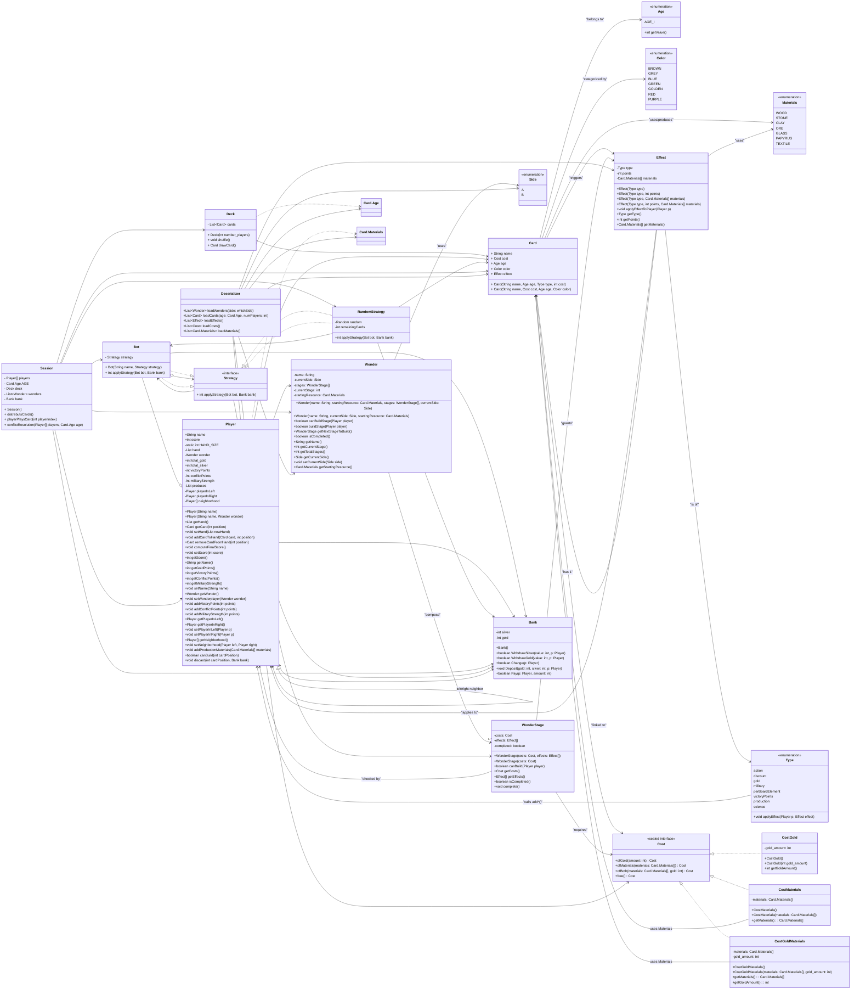

```mermaid
classDiagram
direction LR
    class Session {
    - Player[] players
    - Card.Age AGE
    - Deck deck
    - List~Wonder~ wonders
    - Bank bank
    + Session()
    + distrebutsCards()
    + playerPlaysCard(int playerIndex)
    + conflictResolution(Player[] players, Card.Age age)
    }

    class Player {
        +String name
        +int score
        -static int HAND_SIZE
        -List<Card> hand
        -Wonder wonder
        +int total_gold
        +int total_silver
        -int victoryPoints
        -int conflictPoints
        -int militaryStrength
        -List<Card.Materials> produces
        -Player playerInLeft
        -Player playerInRight
        -Player[] neighborhood

        +Player(String name)
        +Player(String name, Wonder wonder)
        +List<Card> getHand()
        +Card getCard(int position)
        +void setHand(List<Card> newHand)
        +void addCardToHand(Card card, int position)
        +Card removeCardFromHand(int position)
        +void computeFinalScore()
        +void setScore(int score)
        +int getScore()
        +String getName()
        +int getGoldPoints()
        +int getVictoryPoints()
        +int getConflictPoints()
        +int getMilitaryStrength()
        +void setName(String name)
        +Wonder getWonder()
        +void setWonderplayer(Wonder wonder)
        +void addVictoryPoints(int points)
        +void addConflictPoints(int points)
        +void addMilitaryStrength(int points)
        +Player getPlayerInLeft()
        +Player getPlayerInRight()
        +void setPlayerInLeft(Player p)
        +void setPlayerInRight(Player p)
        +Player[] getNeighborhood()
        +void setNeighborhood(Player left, Player right)
        +void addProductionMaterials(Card.Materials[] materials)
        +boolean canBuild(int cardPosition)
        +void discard(int cardPosition, Bank bank)
    }

    class Bot {
    - Strategy strategy
    + Bot(String name, Strategy strategy)
    + int applyStrategy(Bot bot, Bank bank) 
    }

    class Strategy {
    <<interface>>
    + int applyStrategy(Bot bot, Bank bank) 
    }

    class RandomStrategy {
        -Random random
        -int remainingCards
        +int applyStrategy(Bot bot, Bank bank)
    }

    class Card {
    + String name
    + Cost cost 
    + Age age
    + Color color
    + Effect effect
    + Card(String name, Age age, Type type, int cost)
    + Card(String name, Cost cost, Age age, Color color)
    }

    class Age {
        <<enumeration>>
        AGE_I
        +int getValue()
    }

    class Color {
        <<enumeration>>
        BROWN
        GREY
        BLUE
        GREEN
        GOLDEN
        RED
        PURPLE
    }

    class Materials {
        <<enumeration>>
        WOOD
        STONE
        CLAY
        ORE
        GLASS
        PAPYRUS
        TEXTILE
    }

    class Effect {
        -Type type
        -int points
        -Card.Materials[] materials

        +Effect(Type type)
        +Effect(Type type, int points)
        +Effect(Type type, Card.Materials[] materials)
        +Effect(Type type, int points, Card.Materials[] materials)
        +void applyEffectToPlayer(Player p)
        +Type getType()
        +int getPoints()
        +Card.Materials[] getMaterials()
    }

    class Type {
        <<enumeration>>
        action
        discount
        gold
        military
        perBoardElement
        victoryPoints
        production
        science
        +void applyEffect(Player p, Effect effect)
    }

    class Cost {
        <<sealed interface>>
        +ofGold(amount: int) Cost
        +ofMaterials(materials: Card.Materials[]) Cost
        +ofBoth(materials: Card.Materials[], gold: int) Cost
        +free() Cost
    }

    class CostGold {
        -gold_amount: int
        +CostGold()
        +CostGold(int gold_amount)
        +int getGoldAmount()
    }

    class CostMaterials {
        -materials: Card.Materials[]
        +CostMaterials()
        +CostMaterials(materials: Card.Materials[])
        +getMaterials(): Card.Materials[]
    }

    class CostGoldMaterials {
        -materials: Card.Materials[]
        -gold_amount: int    
        +CostGoldMaterials()
        +CostGoldMaterials(materials: Card.Materials[], gold_amount: int)
        +getMaterials(): Card.Materials[]
        +getGoldAmount(): int
    }

    class Deck {
    - List~Card~ cards
    + Deck(int number_players)
    + void shuffle()
    + Card drawCard() 
    }

    class Wonder {
        -name: String
        -currentSide: Side
        -stages: WonderStage[]
        -currentStage: int
        -startingResource: Card.Materials

        +Wonder(name: String, startingResource: Card.Materials, stages: WonderStage[], currentSide: Side)
        +Wonder(name: String, currentSide: Side, startingResource: Card.Materials)
        +boolean canBuildStage(Player player)
        +boolean buildStage(Player player)
        +WonderStage getNextStageToBuild()
        +boolean isCompleted()
        +String getName()
        +int getCurrentStage()
        +int getTotalStages()
        +Side getCurrentSide()
        +void setCurrentSide(Side side)
        +Card.Materials getStartingResource()
    }

    class Side {
        <<enumeration>>
        A
        B
    }

    class WonderStage {
        -costs: Cost
        -effects: Effect[]
        -completed: boolean 

        +WonderStage(costs: Cost, effects: Effect[])
        +WonderStage(costs: Cost)
        +boolean canBuild(Player player)
        +Cost getCosts()
        +Effect[] getEffects()
        +boolean isCompleted()
        +void complete()
    }

    class Bank {
        -int silver
        -int gold

        +Bank()
        +boolean WithdrawSilver(value: int, p: Player)
        +boolean WithdrawGold(value: int, p: Player)
        +boolean Change(p: Player)
        +void Deposit(gold: int, silver: int, p: Player)
        +boolean Pay(p: Player, amount: int)
    }

    class Deserializer {
        +List~Wonder~ loadWonders(side: whichSide)
        +List~Card~ loadCards(age: Card.Age, numPlayers: int)
        +List~Effect~ loadEffects()
        +List~Cost~ loadCosts() 
        +List~Card.Materials~ loadMaterials()
    }

    Bank "1" <--> "0..*" Player

    Bot --|> Player
    Bot ..|> Strategy
    Bot --> Bank
    Bot o--> Strategy

    Deck --> Card
    Deck ..> Card.Age

    Player --> Card
    Player --> Wonder
    Player --> Bank
    Player --> Player : left/right neighbor
    Player ..> Card.Materials

    RandomStrategy ..|> Strategy
    RandomStrategy --> Bot
    RandomStrategy --> Bank
    RandomStrategy --> Card

    Session --> Player
    Session --> Bot
    Session --> Bank
    Session --> Deck
    Session --> Wonder
    Session --> Card
    Session --> RandomStrategy

    Strategy <|.. RandomStrategy
    Strategy <|.. Bot
    Strategy --> Bank
    Strategy --> Bot

    Card --> Age : "belongs to"
    Card --> Color : "categorized by"
    Card --> Materials : "uses/produces"
    Card --> Effect : "triggers"

    Effect --> Type : "is of"
    Effect --> Player : "applies to"
    Effect --> Card : "linked to"
    Effect --> Materials : "uses"
    Type --> Player : "calls add*()"

    Cost <|.. CostGold
    Cost <|.. CostMaterials
    Cost <|.. CostGoldMaterials

    Card --> Cost : "has 1"
    CostGoldMaterials --> Card : uses Materials
    CostMaterials --> Card : uses Materials

    Wonder --> "1..*" WonderStage : "compose"
    WonderStage --> Cost : "requires"
    WonderStage --> Effect : "grants"
    WonderStage --> Player : "checked by"
    Wonder --> Side : "uses"

    Deserializer --> Wonder
    Deserializer --> WonderStage
    Deserializer --> Card
    Deserializer --> Cost
    Deserializer --> Effect
    Deserializer --> Card.Age
    Deserializer --> Side
    Deserializer --> Card.Materials
```