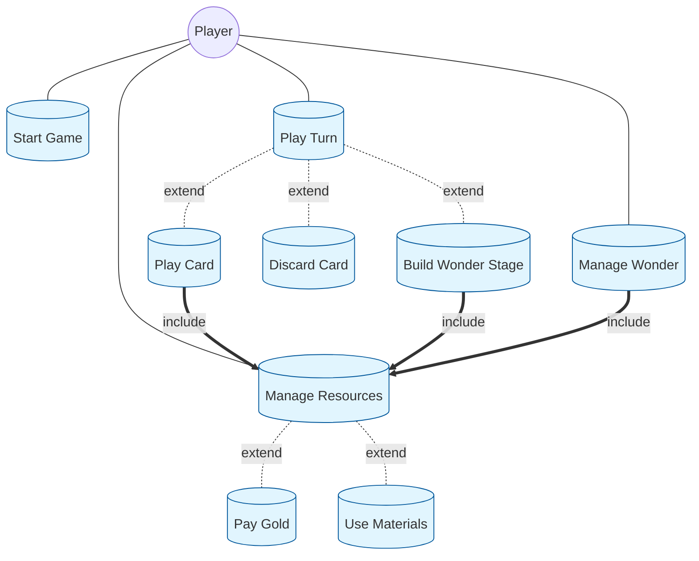

```mermaid
graph TB
    %% Actor
    Actor((Player))
    
    %% Main use cases with oval shapes
    UC1[("Start Game")]
    UC2[("Play Turn")]
    UC3[("Manage Resources")]
    UC4[("Manage Wonder")]
    
    %% Sub use cases
    UC2_1[("Play Card")]
    UC2_2[("Discard Card")]
    UC2_3[("Build Wonder Stage")]
    UC3_1[("Pay Gold")]
    UC3_2[("Use Materials")]
    
    %% Basic relationships
    Actor --- UC1
    Actor --- UC2
    Actor --- UC3
    Actor --- UC4
    
    %% Include relationships with text
    UC2_1 ==> |"include"| UC3
    UC2_3 ==> |"include"| UC3
    UC4 ==> |"include"| UC3
    
    %% Extend relationships with text
    UC2 -.- |"extend"| UC2_1
    UC2 -.- |"extend"| UC2_2
    UC2 -.- |"extend"| UC2_3
    UC3 -.- |"extend"| UC3_1
    UC3 -.- |"extend"| UC3_2

    %% Styling
    classDef usecase fill:#E1F5FE,stroke:#01579B
    class UC1,UC2,UC3,UC4,UC2_1,UC2_2,UC2_3,UC3_1,UC3_2 usecase
```