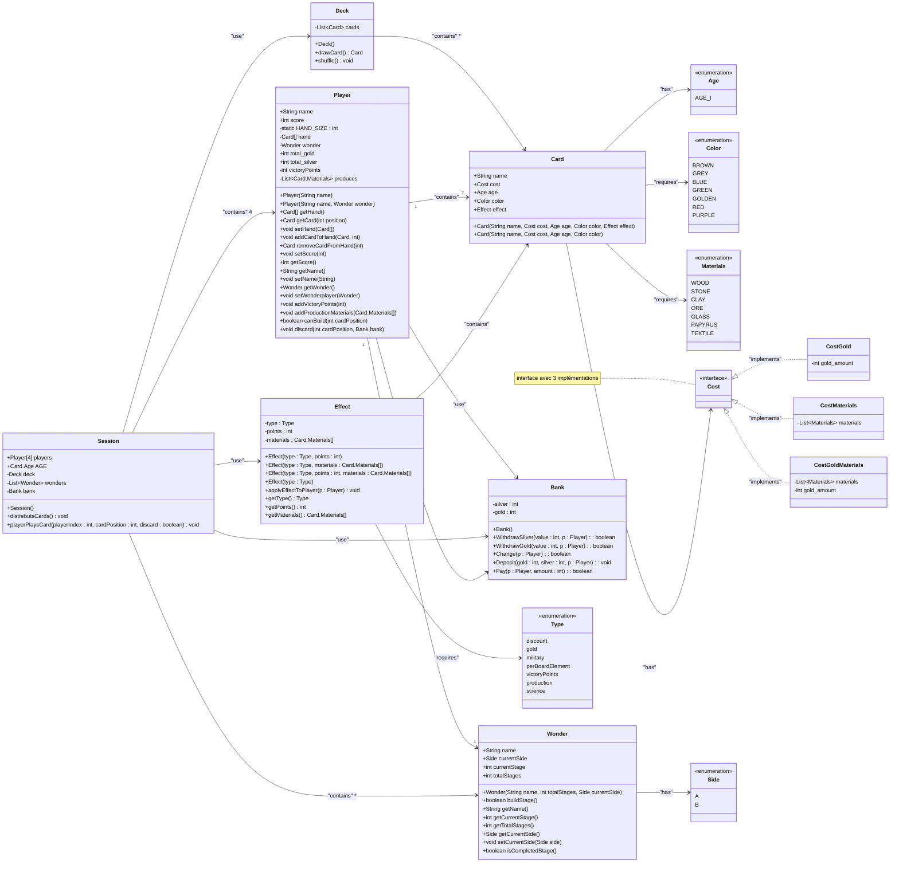

```mermaid
classDiagram
    direction LR

    class Session {
        +Player[4] players
        +Card.Age AGE
        -Deck deck
        -List~Wonder~ wonders
        -Bank bank
        +Session()
        +distrebutsCards() void
        +playerPlaysCard(playerIndex : int, cardPosition : int, discard : boolean) void
    }

    class Player {
        +String name
        +int score
        -static HAND_SIZE : int
        -Card[] hand
        -Wonder wonder
        +int total_gold
        +int total_silver
        -int victoryPoints
        -List~Card.Materials~ produces
        +Player(String name)
        +Player(String name, Wonder wonder)
        +Card[] getHand()
        +Card getCard(int position)
        +void setHand(Card[])
        +void addCardToHand(Card, int)
        +Card removeCardFromHand(int)
        +void setScore(int)
        +int getScore()
        +String getName()
        +void setName(String)
        +Wonder getWonder()
        +void setWonderplayer(Wonder)
        +void addVictoryPoints(int)
        +void addProductionMaterials(Card.Materials[])
        +boolean canBuild(int cardPosition)
        +void discard(int cardPosition, Bank bank)
    }

    class Deck {
        -List~Card~ cards
        +Deck()
        +drawCard() Card
        +shuffle() void
    }

    class Card {
        +String name
        +Cost cost
        +Age age
        +Color color
        +Effect effect
        +Card(String name, Cost cost, Age age, Color color, Effect effect)
        +Card(String name, Cost cost, Age age, Color color)
    }

    class Age {
        <<enumeration>>
        AGE_I
    }

    class Color {
        <<enumeration>>
        BROWN
        GREY
        BLUE
        GREEN
        GOLDEN
        RED
        PURPLE
    }

    class Materials {
        <<enumeration>>
        WOOD
        STONE
        CLAY
        ORE
        GLASS
        PAPYRUS
        TEXTILE
    }

    class Cost {
        <<interface>>
    }

    class CostGold {
        -int gold_amount
    }

    class CostMaterials {
        -List~Materials~ materials
    }

    class CostGoldMaterials {
        -List~Materials~ materials
        -int gold_amount
    }

    class Wonder {
        +String name
        +Side currentSide
        +int currentStage
        +int totalStages
        +Wonder(String name, int totalStages, Side currentSide)
        +boolean buildStage()
        +String getName()
        +int getCurrentStage()
        +int getTotalStages()
        +Side getCurrentSide()
        +void setCurrentSide(Side side)
        +boolean isCompletedStage()
    }

    class Side {
        <<enumeration>>
        A
        B
    }


    class Bank {
        -silver : int
        -gold : int
        +Bank()
        +WithdrawSilver(value : int, p : Player) : boolean
        +WithdrawGold(value : int, p : Player) : boolean
        +Change(p : Player) : boolean
        +Deposit(gold : int, silver : int, p : Player) : void
        +Pay(p : Player, amount : int) : boolean
    }

    class Effect {
        -type : Type
        -points : int
        -materials : Card.Materials[]
        +Effect(type : Type, points : int)
        +Effect(type : Type, materials : Card.Materials[])
        +Effect(type : Type, points : int, materials : Card.Materials[])
        +Effect(type : Type)
        +applyEffectToPlayer(p : Player) void
        +getType() Type
        +getPoints() int
        +getMaterials() Card.Materials[]
    }

    class Type {
        <<enumeration>>
        discount
        gold
        military
        perBoardElement
        victoryPoints
        production
        science
    }

    Session --> Deck : "use"
    Session --> Player : "contains" 4
    Deck --> Card : "contains" *
    Player "1" --> "1" Wonder
    Player "1" --> "7" Card : "contains"
    Card --> Age : "has"
    Card --> Color : "requires"
    Card --> Materials : "requires"
    Card --> Cost : "has"
    Cost <|.. CostGold : "implements"
    Cost <|.. CostMaterials : "implements"
    Cost <|.. CostGoldMaterials : "implements"
    Bank <-- Player : "use"
    Effect --> Card : "contains"
    Session --> Effect : "use"
    Effect --> Type : "requires"
    Player --> Bank : "use"

    Session --> Bank : "use"
    Session --> Wonder : "contains" *

    Wonder --> Side : "has"

    %% Notes
    note for Cost "interface avec 3 implémentations"

```