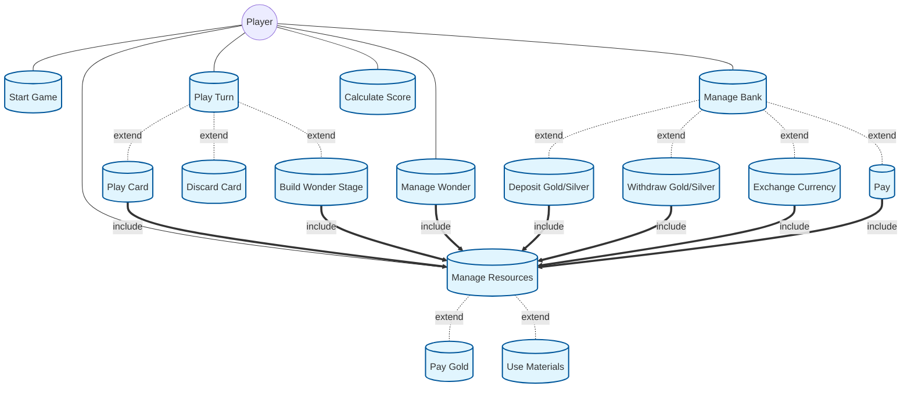

```mermaid
graph TB
    %% Actor
    Player((Player))
    
    %% Main use cases
    UC1[("Start Game")]
    UC2[("Play Turn")]
    UC3[("Manage Resources")]
    UC4[("Manage Wonder")]
    UC5[("Manage Bank")]
    UC6[("Calculate Score")]

    %% Sub use cases
    UC2_1[("Play Card")]
    UC2_2[("Discard Card")]
    UC2_3[("Build Wonder Stage")]
    UC3_1[("Pay Gold")]
    UC3_2[("Use Materials")]
    UC5_1[("Deposit Gold/Silver")]
    UC5_2[("Withdraw Gold/Silver")]
    UC5_3[("Exchange Currency")]
    UC5_4[("Pay")]

    %% Relationships
    Player --- UC1
    Player --- UC2
    Player --- UC3
    Player --- UC4
    Player --- UC5
    Player --- UC6

    %% Include relations
    UC2_1 ==> |"include"| UC3
    UC2_3 ==> |"include"| UC3
    UC4 ==> |"include"| UC3
    UC5_1 ==> |"include"| UC3
    UC5_2 ==> |"include"| UC3
    UC5_3 ==> |"include"| UC3
    UC5_4 ==> |"include"| UC3

    %% Extend relations
    UC2 -.- |"extend"| UC2_1
    UC2 -.- |"extend"| UC2_2
    UC2 -.- |"extend"| UC2_3
    UC3 -.- |"extend"| UC3_1
    UC3 -.- |"extend"| UC3_2
    UC5 -.- |"extend"| UC5_1
    UC5 -.- |"extend"| UC5_2
    UC5 -.- |"extend"| UC5_3
    UC5 -.- |"extend"| UC5_4

    %% Styling
    classDef usecase fill:#E1F5FE,stroke:#01579B,stroke-width:2px
    class UC1,UC2,UC3,UC4,UC5,UC6,UC2_1,UC2_2,UC2_3,UC3_1,UC3_2,UC5_1,UC5_2,UC5_3,UC5_4 usecase
```