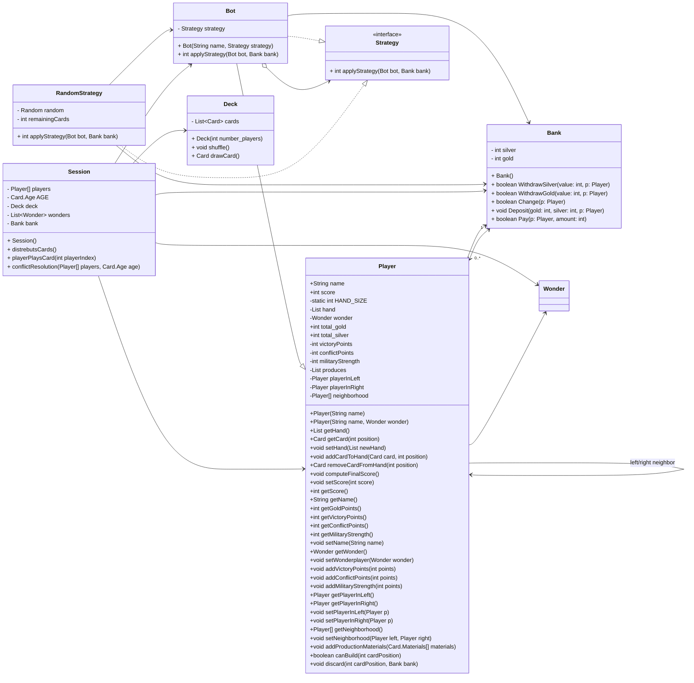

```mermaid
classDiagram
direction LR

    class Session {
        - Player[] players
        - Card.Age AGE
        - Deck deck
        - List~Wonder~ wonders
        - Bank bank
        + Session()
        + distrebutsCards()
        + playerPlaysCard(int playerIndex)
        + conflictResolution(Player[] players, Card.Age age)
    }

    class Player {
        +String name
        +int score
        -static int HAND_SIZE
        -List<Card> hand
        -Wonder wonder
        +int total_gold
        +int total_silver
        -int victoryPoints
        -int conflictPoints
        -int militaryStrength
        -List<Card.Materials> produces
        -Player playerInLeft
        -Player playerInRight
        -Player[] neighborhood

        +Player(String name)
        +Player(String name, Wonder wonder)
        +List<Card> getHand()
        +Card getCard(int position)
        +void setHand(List<Card> newHand)
        +void addCardToHand(Card card, int position)
        +Card removeCardFromHand(int position)
        +void computeFinalScore()
        +void setScore(int score)
        +int getScore()
        +String getName()
        +int getGoldPoints()
        +int getVictoryPoints()
        +int getConflictPoints()
        +int getMilitaryStrength()
        +void setName(String name)
        +Wonder getWonder()
        +void setWonderplayer(Wonder wonder)
        +void addVictoryPoints(int points)
        +void addConflictPoints(int points)
        +void addMilitaryStrength(int points)
        +Player getPlayerInLeft()
        +Player getPlayerInRight()
        +void setPlayerInLeft(Player p)
        +void setPlayerInRight(Player p)
        +Player[] getNeighborhood()
        +void setNeighborhood(Player left, Player right)
        +void addProductionMaterials(Card.Materials[] materials)
        +boolean canBuild(int cardPosition)
        +void discard(int cardPosition, Bank bank)
    }

    class Bot {
        - Strategy strategy
        + Bot(String name, Strategy strategy)
        + int applyStrategy(Bot bot, Bank bank)
    }

    class Strategy {
        <<interface>>
        + int applyStrategy(Bot bot, Bank bank)
    }

    class RandomStrategy {
        - Random random
        - int remainingCards
        + int applyStrategy(Bot bot, Bank bank)
    }

    class Deck {
        - List~Card~ cards
        + Deck(int number_players)
        + void shuffle()
        + Card drawCard()
    }

    class Bank {
        - int silver
        - int gold
        + Bank()
        + boolean WithdrawSilver(value: int, p: Player)
        + boolean WithdrawGold(value: int, p: Player)
        + boolean Change(p: Player)
        + void Deposit(gold: int, silver: int, p: Player)
        + boolean Pay(p: Player, amount: int)
    }

    %% Relations
    Bot --|> Player
    Bot ..|> Strategy
    Bot --> Bank
    Bot o--> Strategy
    RandomStrategy ..|> Strategy
    RandomStrategy --> Bot
    RandomStrategy --> Bank
    Session --> Player
    Session --> Bot
    Session --> Bank
    Session --> Deck
    Session --> Wonder
    Player --> Bank
    Player --> Wonder
    Player --> Player : left/right neighbor
    Bank "1" <--> "0..*" Player
```