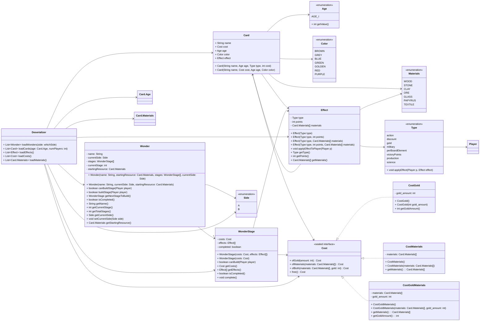

```mermaid
classDiagram
direction LR

    class Card {
        + String name
        + Cost cost
        + Age age
        + Color color
        + Effect effect
        + Card(String name, Age age, Type type, int cost)
        + Card(String name, Cost cost, Age age, Color color)
    }

    class Age {
        <<enumeration>>
        AGE_I
        + int getValue()
    }

    class Color {
        <<enumeration>>
        BROWN
        GREY
        BLUE
        GREEN
        GOLDEN
        RED
        PURPLE
    }

    class Materials {
        <<enumeration>>
        WOOD
        STONE
        CLAY
        ORE
        GLASS
        PAPYRUS
        TEXTILE
    }

    class Effect {
        - Type type
        - int points
        - Card.Materials[] materials
        + Effect(Type type)
        + Effect(Type type, int points)
        + Effect(Type type, Card.Materials[] materials)
        + Effect(Type type, int points, Card.Materials[] materials)
        + void applyEffectToPlayer(Player p)
        + Type getType()
        + int getPoints()
        + Card.Materials[] getMaterials()
    }

    class Type {
        <<enumeration>>
        action
        discount
        gold
        military
        perBoardElement
        victoryPoints
        production
        science
        + void applyEffect(Player p, Effect effect)
    }

    class Cost {
        <<sealed interface>>
        + ofGold(amount: int) Cost
        + ofMaterials(materials: Card.Materials[]) Cost
        + ofBoth(materials: Card.Materials[], gold: int) Cost
        + free() Cost
    }

    class CostGold {
        - gold_amount: int
        + CostGold()
        + CostGold(int gold_amount)
        + int getGoldAmount()
    }

    class CostMaterials {
        - materials: Card.Materials[]
        + CostMaterials()
        + CostMaterials(materials: Card.Materials[])
        + getMaterials(): Card.Materials[]
    }

    class CostGoldMaterials {
        - materials: Card.Materials[]
        - gold_amount: int
        + CostGoldMaterials()
        + CostGoldMaterials(materials: Card.Materials[], gold_amount: int)
        + getMaterials(): Card.Materials[]
        + getGoldAmount(): int
    }

    class Wonder {
        - name: String
        - currentSide: Side
        - stages: WonderStage[]
        - currentStage: int
        - startingResource: Card.Materials
        + Wonder(name: String, startingResource: Card.Materials, stages: WonderStage[], currentSide: Side)
        + Wonder(name: String, currentSide: Side, startingResource: Card.Materials)
        + boolean canBuildStage(Player player)
        + boolean buildStage(Player player)
        + WonderStage getNextStageToBuild()
        + boolean isCompleted()
        + String getName()
        + int getCurrentStage()
        + int getTotalStages()
        + Side getCurrentSide()
        + void setCurrentSide(Side side)
        + Card.Materials getStartingResource()
    }

    class WonderStage {
        - costs: Cost
        - effects: Effect[]
        - completed: boolean
        + WonderStage(costs: Cost, effects: Effect[])
        + WonderStage(costs: Cost)
        + boolean canBuild(Player player)
        + Cost getCosts()
        + Effect[] getEffects()
        + boolean isCompleted()
        + void complete()
    }

    class Side {
        <<enumeration>>
        A
        B
    }

    class Deserializer {
        + List~Wonder~ loadWonders(side: whichSide)
        + List~Card~ loadCards(age: Card.Age, numPlayers: int)
        + List~Effect~ loadEffects()
        + List~Cost~ loadCosts()
        + List~Card.Materials~ loadMaterials()
    }

    %% Relations
    Card --> Age
    Card --> Color
    Card --> Materials
    Card --> Effect
    Card --> Cost
    Effect --> Type
    Effect --> Card
    Effect --> Materials
    Type --> Player
    Cost <|.. CostGold
    Cost <|.. CostMaterials
    Cost <|.. CostGoldMaterials
    Wonder --> "1..*" WonderStage
    WonderStage --> Cost
    WonderStage --> Effect
    Wonder --> Side
    Deserializer --> Wonder
    Deserializer --> WonderStage
    Deserializer --> Card
    Deserializer --> Cost
    Deserializer --> Effect
    Deserializer --> Card.Age
    Deserializer --> Side
    Deserializer --> Card.Materials
```