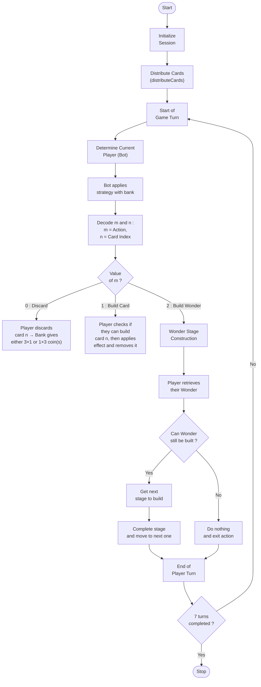

```mermaid
flowchart TD
    A([Start <br>]) --> B["Initialize<br>Session"]
    B --> C["Distribute Cards<br>(distributeCards)"]

    C --> D["Start of<br>Game Turn"]
    D --> E["Determine Current<br>Player (Bot)"]
    E --> F["Bot applies<br>strategy with bank"]
    F --> G["Decode m and n :<br>m = Action,<br>n = Card Index"]

    G --> H{"Value<br>of m ?"}
    H -->|0 : Discard| I["Player discards<br>card n → Bank gives<br>either 3×1 or 1×3 coin(s)"]
    H -->|1 : Build Card| J["Player checks if<br>they can build<br>card n, then applies<br>effect and removes it"]
    H -->|2 : Build Wonder| K["Wonder Stage<br>Construction"]

    K --> L["Player retrieves<br>their Wonder"]
    L --> M{"Can Wonder<br>still be built ?"}
    M -->|Yes| N["Get next<br>stage to build"]
    M -->|No| O["Do nothing<br>and exit action"]

    N --> Q["Complete stage<br>and move to next one"]
    Q --> S["End of<br>Player Turn"]
    O --> S

    %% Boucle des 7 tours
    S --> T{"7 turns<br>completed ?"}
    T -->|No| D
    T -->|Yes| U([Stop])

```