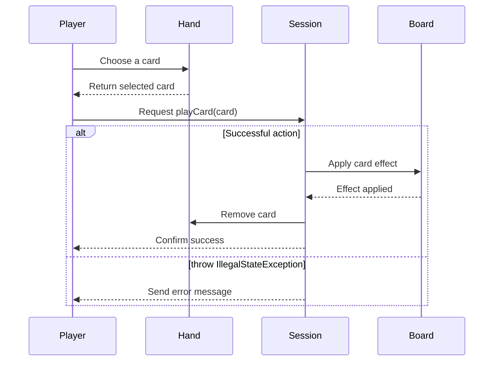

```mermaid
sequenceDiagram
participant Player
participant Hand
participant Session
participant Board

Player->>Hand: Choose a card
Hand-->>Player: Return selected card
Player->>Session: Request playCard(card)
alt Successful action
    Session->>Board: Apply card effect
    Board-->>Session: Effect applied
    Session->>Hand: Remove card
    Session-->>Player: Confirm success
else throw IllegalStateException
    Session-->>Player: Send error message
end

```