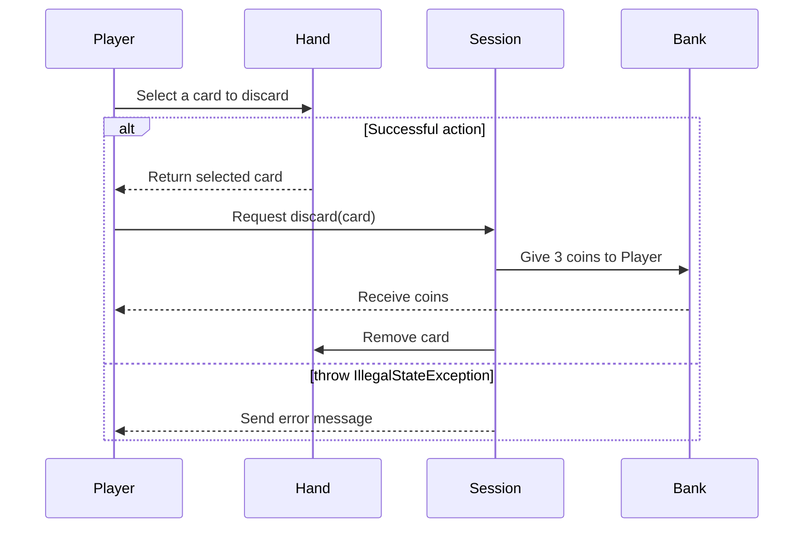

```mermaid
sequenceDiagram
participant Player
participant Hand
participant Session
participant Bank

Player->>Hand: Select a card to discard
alt Successful action
    Hand-->>Player: Return selected card
    Player->>Session: Request discard(card)
    Session->>Bank: Give 3 coins to Player
    Bank-->>Player: Receive coins
    Session->>Hand: Remove card
else throw IllegalStateException
    Session-->>Player: Send error message
end


```