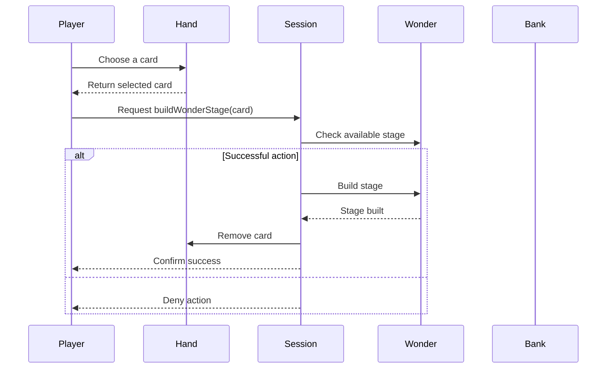

```mermaid
sequenceDiagram
participant Player
participant Hand
participant Session
participant Wonder
participant Bank

Player->>Hand: Choose a card
Hand-->>Player: Return selected card
Player->>Session: Request buildWonderStage(card)
Session->>Wonder: Check available stage
alt Successful action
    Session->>Wonder: Build stage
    Wonder-->>Session: Stage built
    Session->>Hand: Remove card
    Session-->>Player: Confirm success
else 
    Session-->>Player: Deny action
end

```