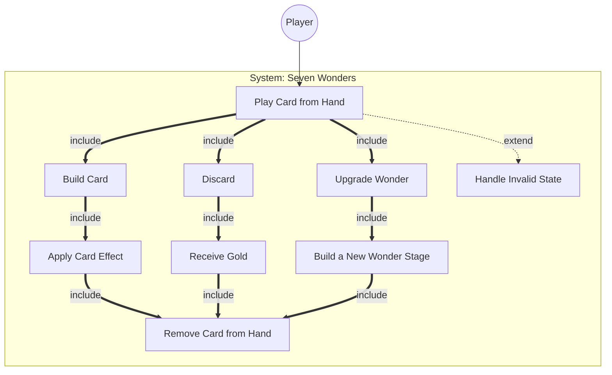

```mermaid 
graph TD
    P((Player)) 
    subgraph "System: Seven Wonders" 
        UC1["Play Card from Hand"] 
        UC2["Build Card"] 
        UC3["Apply Card Effect"] 
        UC4["Remove Card from Hand"] 
        UC5["Discard"] 
        UC6["Receive Gold"] 
        UC7["Upgrade Wonder"] 
        UC8["Build a New Wonder Stage"] 
        UC9["Handle Invalid State"] 
    end
    P --> UC1 
    UC1 ==> |"include"| UC2 
    UC2 ==> |"include"| UC3 
    UC3 ==> |"include"| UC4
    UC1 ==> |"include"| UC5 
    UC5 ==> |"include"| UC6 
    UC6 ==> |"include"| UC4 
    UC1 ==> |"include"| UC7 
    UC7 ==> |"include"| UC8 
    UC8 ==> |"include"| UC4 
    UC1 -.-> |"extend"| UC9
```