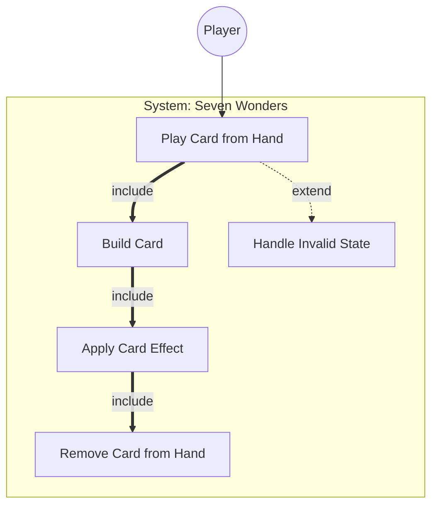

```mermaid
graph TD
    P((Player))

    subgraph "System: Seven Wonders"
        UC1["Play Card from Hand"]
        UC2["Build Card"]
        UC3["Apply Card Effect"]
        UC4["Remove Card from Hand"]
        UC9["Handle Invalid State"]
    end

    %% Player initiates main use case
    P --> UC1

    %% Build card path
    UC1 ==> |"include"| UC2
    UC2 ==> |"include"| UC3
    UC3 ==> |"include"| UC4

    %% Exception handling
    UC1 -.-> |"extend"| UC9

```