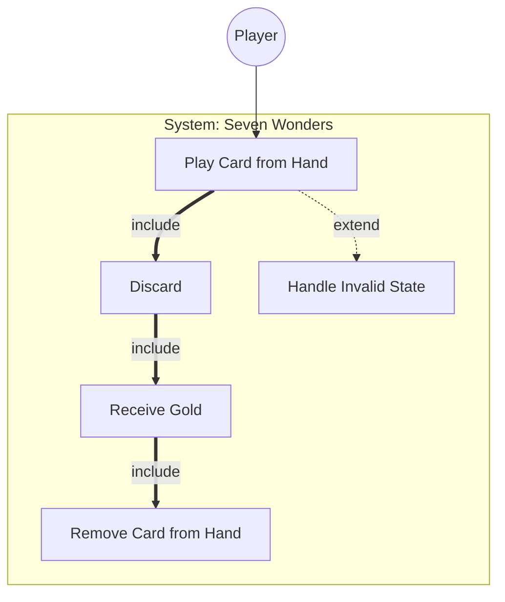

```mermaid
graph TD
    P((Player))

    subgraph "System: Seven Wonders"
        UC1["Play Card from Hand"]
        UC5["Discard"]
        UC6["Receive Gold"]
        UC4["Remove Card from Hand"]
        UC9["Handle Invalid State"]
    end

    P --> UC1

    %% Discard for gold path
    UC1 ==> |"include"| UC5
    UC5 ==> |"include"| UC6
    UC6 ==> |"include"| UC4

    %% Exception handling
    UC1 -.-> |"extend"| UC9

```