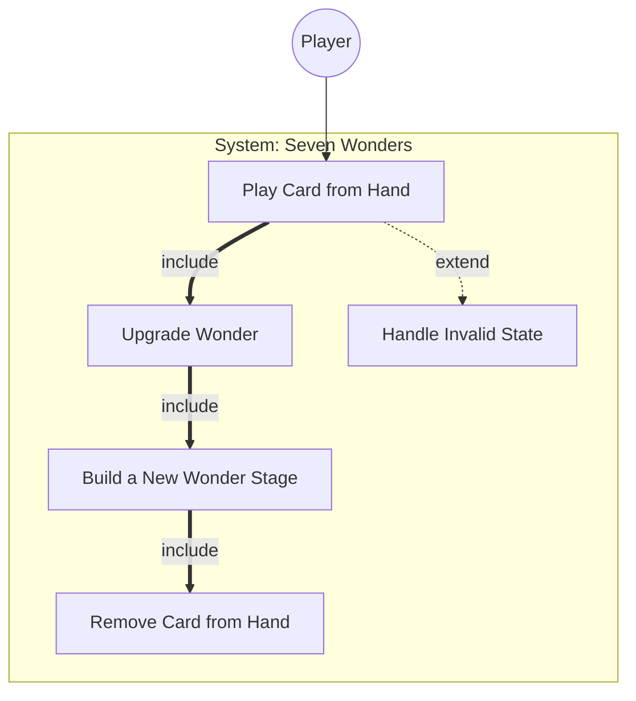

```mermaid
graph TD
    P((Player))

    subgraph "System: Seven Wonders"
        UC1["Play Card from Hand"]
        UC7["Upgrade Wonder"]
        UC8["Build a New Wonder Stage"]
        UC4["Remove Card from Hand"]
        UC9["Handle Invalid State"]
    end

    P --> UC1

    %% Upgrade wonder path
    UC1 ==> |"include"| UC7
    UC7 ==> |"include"| UC8
    UC8 ==> |"include"| UC4

    %% Exception handling
    UC1 -.-> |"extend"| UC9
```