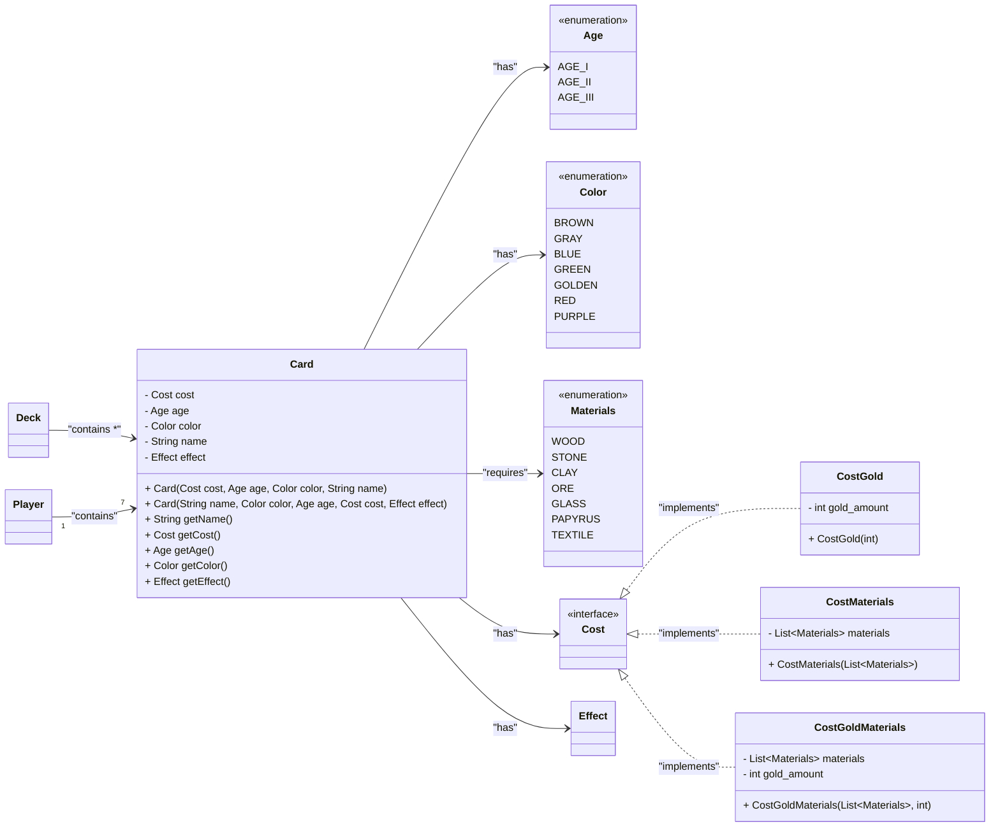

```mermaid
classDiagram
direction LR

%% ============================
%% ENUMERATIONS
%% ============================

class Age {
    <<enumeration>>
    AGE_I
    AGE_II
    AGE_III
}

class Color {
    <<enumeration>>
    BROWN
    GRAY
    BLUE
    GREEN
    GOLDEN
    RED
    PURPLE
}

class Materials {
    <<enumeration>>
    WOOD
    STONE
    CLAY
    ORE
    GLASS
    PAPYRUS
    TEXTILE
}

%% ============================
%% CLASSES PRINCIPALES
%% ============================

class Player {
    
}

class Deck {
}

class Card {
    - Cost cost
    - Age age
    - Color color
    - String name
    - Effect effect
    + Card(Cost cost, Age age, Color color, String name)
    + Card(String name, Color color, Age age, Cost cost, Effect effect)
    + String getName()
    + Cost getCost()
    + Age getAge()
    + Color getColor()
    + Effect getEffect()
}

class Cost {
    <<interface>>
}

class CostGold {
    - int gold_amount
    + CostGold(int)
}

class CostMaterials {
    - List~Materials~ materials
    + CostMaterials(List~Materials~)
}

class CostGoldMaterials {
    - List~Materials~ materials
    - int gold_amount
    + CostGoldMaterials(List~Materials~, int)
}

class Effect {
}

%% ============================
%% RELATIONS
%% ============================


Deck --> Card : "contains *"
Player "1" --> "7" Card : "contains"
Card --> Age : "has"
Card --> Color : "has"
Card --> Materials : "requires"
Card --> Cost : "has"
Card --> Effect : "has"
Cost <|.. CostGold : "implements"
Cost <|.. CostMaterials : "implements"
Cost <|.. CostGoldMaterials : "implements"


```