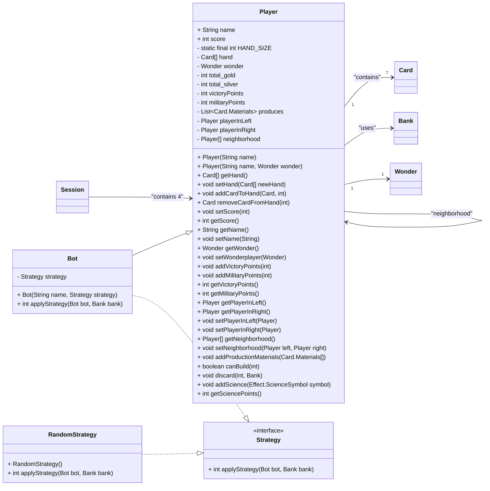

```mermaid
classDiagram
direction LR

%% ============================
%% CLASSES PRINCIPALES
%% ============================

class Session {
}

class Player {
    + String name
    + int score
    - static final int HAND_SIZE
    - Card[] hand
    - Wonder wonder
    - int total_gold
    - int total_silver
    - int victoryPoints
    - int militaryPoints
    - List~Card.Materials~ produces
    - Player playerInLeft
    - Player playerInRight
    - Player[] neighborhood
    + Player(String name)
    + Player(String name, Wonder wonder)
    + Card[] getHand()
    + void setHand(Card[] newHand)
    + void addCardToHand(Card, int)
    + Card removeCardFromHand(int)
    + void setScore(int)
    + int getScore()
    + String getName()
    + void setName(String)
    + Wonder getWonder()
    + void setWonderplayer(Wonder)
    + void addVictoryPoints(int)
    + void addMilitaryPoints(int)
    + int getVictoryPoints()
    + int getMilitaryPoints()
    + Player getPlayerInLeft()
    + Player getPlayerInRight()
    + void setPlayerInLeft(Player)
    + void setPlayerInRight(Player)
    + Player[] getNeighborhood()
    + void setNeighborhood(Player left, Player right)
    + void addProductionMaterials(Card.Materials[])
    + boolean canBuild(int)
    + void discard(int, Bank)
    + void addScience(Effect.ScienceSymbol symbol)
    + int getSciencePoints()
}

class Bot {
    - Strategy strategy
    + Bot(String name, Strategy strategy)
    + int applyStrategy(Bot bot, Bank bank)
}


class Card {
}

class Bank {
}

class Wonder {
}

%% ============================
%% STRATEGY SYSTEM
%% ============================

class Strategy {
    <<interface>>
    + int applyStrategy(Bot bot, Bank bank)
}

class RandomStrategy {
    + RandomStrategy()
    + int applyStrategy(Bot bot, Bank bank)
}

%% ============================
%% RELATIONS
%% ============================

Session --> Player : "contains 4"
Player "1" --> "1" Wonder
Player "1" --> "7" Card : "contains"
Player --> Bank : "uses"
Player --> Player : "neighborhood"
Bot --|> Player
Bot ..|> Strategy
RandomStrategy ..|> Strategy

```