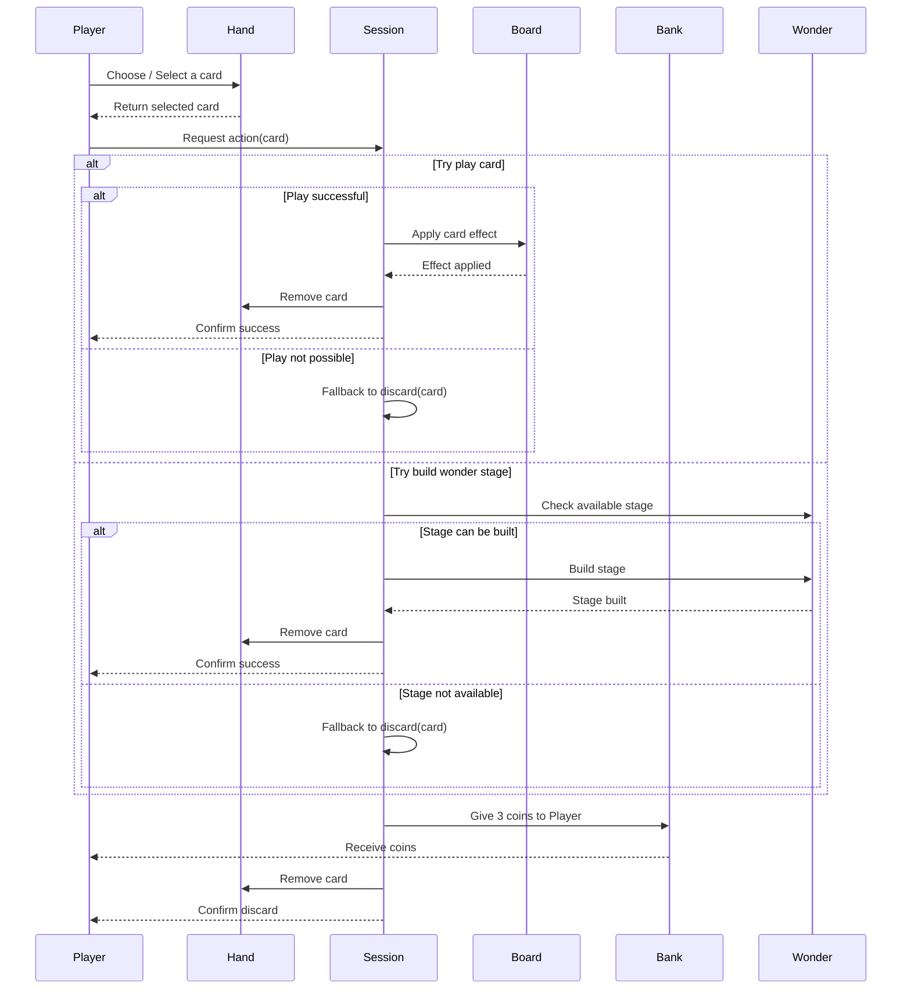

```mermaid
sequenceDiagram
participant Player
participant Hand
participant Session
participant Board
participant Bank
participant Wonder

Player->>Hand: Choose / Select a card
Hand-->>Player: Return selected card
Player->>Session: Request action(card)

alt Try play card
    alt Play successful
        Session->>Board: Apply card effect
        Board-->>Session: Effect applied
        Session->>Hand: Remove card
        Session-->>Player: Confirm success
    else Play not possible
        Session->>Session: Fallback to discard(card)
    end

else Try build wonder stage
    Session->>Wonder: Check available stage
    alt Stage can be built
        Session->>Wonder: Build stage
        Wonder-->>Session: Stage built
        Session->>Hand: Remove card
        Session-->>Player: Confirm success
    else Stage not available
        Session->>Session: Fallback to discard(card)
    end
end

%% Fallback discard is always safe
Session->>Bank: Give 3 coins to Player
Bank-->>Player: Receive coins
Session->>Hand: Remove card
Session-->>Player: Confirm discard


```