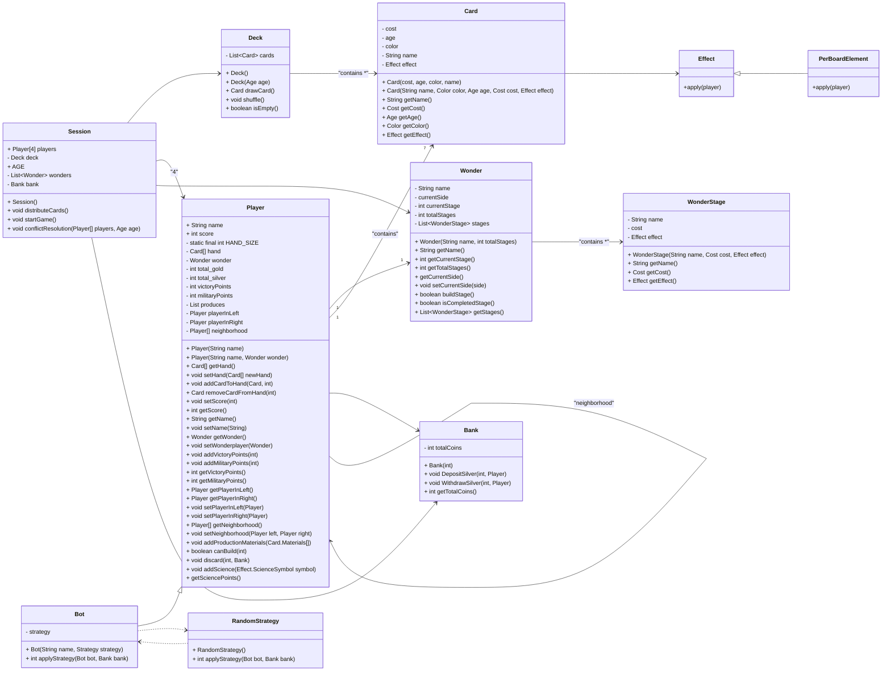

```mermaid
classDiagram
direction LR

%% ============================
%% CLASSES PRINCIPALES
%% ============================

class Session {
    + Player[4] players
    - Deck deck
    + AGE
    - List~Wonder~ wonders
    - Bank bank
    + Session()
    + void distributeCards()
    + void startGame()
    + void conflictResolution(Player[] players, Age age)
}

class Player {
    + String name
    + int score
    - static final int HAND_SIZE
    - Card[] hand
    - Wonder wonder
    - int total_gold
    - int total_silver
    - int victoryPoints
    - int militaryPoints
    - List produces
    - Player playerInLeft
    - Player playerInRight
    - Player[] neighborhood
    + Player(String name)
    + Player(String name, Wonder wonder)
    + Card[] getHand()
    + void setHand(Card[] newHand)
    + void addCardToHand(Card, int)
    + Card removeCardFromHand(int)
    + void setScore(int)
    + int getScore()
    + String getName()
    + void setName(String)
    + Wonder getWonder()
    + void setWonderplayer(Wonder)
    + void addVictoryPoints(int)
    + void addMilitaryPoints(int)
    + int getVictoryPoints()
    + int getMilitaryPoints()
    + Player getPlayerInLeft()
    + Player getPlayerInRight()
    + void setPlayerInLeft(Player)
    + void setPlayerInRight(Player)
    + Player[] getNeighborhood()
    + void setNeighborhood(Player left, Player right)
    + void addProductionMaterials(Card.Materials[])
    + boolean canBuild(int)
    + void discard(int, Bank)
    + void addScience(Effect.ScienceSymbol symbol)
    + getSciencePoints()
}

class Bot {
    - strategy
    + Bot(String name, Strategy strategy)
    + int applyStrategy(Bot bot, Bank bank)
}

class Deck {
    - List~Card~ cards
    + Deck()
    + Deck(Age age)
    + Card drawCard()
    + void shuffle()
    + boolean isEmpty()
}

class Card {
    - cost
    - age
    - color
    - String name
    - Effect effect
    + Card(cost, age, color, name)
    + Card(String name, Color color, Age age, Cost cost, Effect effect)
    + String getName()
    + Cost getCost()
    + Age getAge()
    + Color getColor()
    + Effect getEffect()
}

class Effect {
    +apply(player)
}

class PerBoardElement {
    +apply(player)
}

class Bank {
    - int totalCoins
    + Bank(int)
    + void DepositSilver(int, Player)
    + void WithdrawSilver(int, Player)
    + int getTotalCoins()
}

class Wonder {
    - String name
    - currentSide
    - int currentStage
    - int totalStages
    - List~WonderStage~ stages
    + Wonder(String name, int totalStages)
    + String getName()
    + int getCurrentStage()
    + int getTotalStages()
    + getCurrentSide()
    + void setCurrentSide(side)
    + boolean buildStage()
    + boolean isCompletedStage()
    + List~WonderStage~ getStages()
}

class WonderStage {
    - String name
    - cost
    - Effect effect
    + WonderStage(String name, Cost cost, Effect effect)
    + String getName()
    + Cost getCost()
    + Effect getEffect()
}

class RandomStrategy {
    + RandomStrategy()
    + int applyStrategy(Bot bot, Bank bank)
}

%% ============================
%% RELATIONS
%% ============================

Session --> Deck
Session --> Player : "4"
Session --> Wonder
Session --> Bank

Deck --> Card : "contains *"

Player "1" --> "1" Wonder
Player "1" --> "7" Card : "contains"
Player --> Bank
Player --> Player : "neighborhood"

Card --> Effect
Effect <|-- PerBoardElement

Wonder --> WonderStage : "contains *"

Bot --|> Player
Bot ..> RandomStrategy
RandomStrategy ..> Bot
```