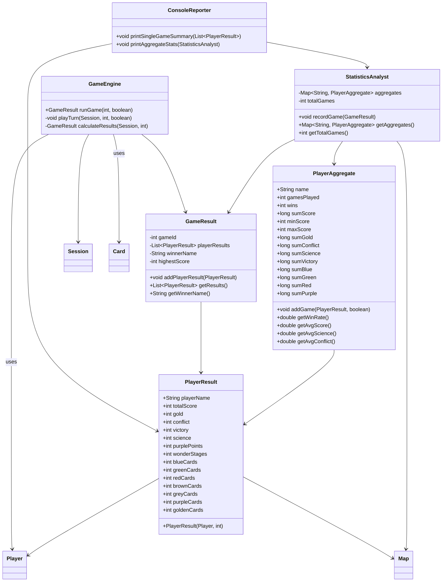

```mermaid
classDiagram
direction TB

%% ============================
%% CORE
%% ============================
class GameEngine {
    +GameResult runGame(int, boolean)
    -void playTurn(Session, int, boolean)
    -GameResult calculateResults(Session, int)
}

%% ============================
%% REPORTING
%% ============================
class ConsoleReporter {
    +void printSingleGameSummary(List~PlayerResult~)
    +void printAggregateStats(StatisticsAnalyst)
}

%% ============================
%% STATS
%% ============================
class GameResult {
    -int gameId
    -List~PlayerResult~ playerResults
    -String winnerName
    -int highestScore
    +void addPlayerResult(PlayerResult)
    +List~PlayerResult~ getResults()
    +String getWinnerName()
}

class PlayerResult {
    +String playerName
    +int totalScore
    +int gold
    +int conflict
    +int victory
    +int science
    +int purplePoints

    +int wonderStages
    +int blueCards
    +int greenCards
    +int redCards
    +int brownCards
    +int greyCards
    +int purpleCards
    +int goldenCards

    +PlayerResult(Player, int)
}

class StatisticsAnalyst {
    -Map~String, PlayerAggregate~ aggregates
    -int totalGames
    +void recordGame(GameResult)
    +Map~String, PlayerAggregate~ getAggregates()
    +int getTotalGames()
}

class PlayerAggregate {
    +String name
    +int gamesPlayed
    +int wins
    +long sumScore
    +int minScore
    +int maxScore
    +long sumGold
    +long sumConflict
    +long sumScience
    +long sumVictory
    +long sumBlue
    +long sumGreen
    +long sumRed
    +long sumPurple
    +void addGame(PlayerResult, boolean)
    +double getWinRate()
    +double getAvgScore()
    +double getAvgScience()
    +double getAvgConflict()
}

%% ============================
%% RELATIONS
%% ============================
GameEngine --> GameResult
GameEngine --> Session
GameEngine --> Player : uses
GameEngine --> Card : uses

ConsoleReporter --> PlayerResult
ConsoleReporter --> StatisticsAnalyst

StatisticsAnalyst --> GameResult
StatisticsAnalyst --> PlayerAggregate

GameResult --> PlayerResult
PlayerResult --> Player
PlayerResult --> Map
StatisticsAnalyst --> Map

PlayerAggregate --> PlayerResult
```