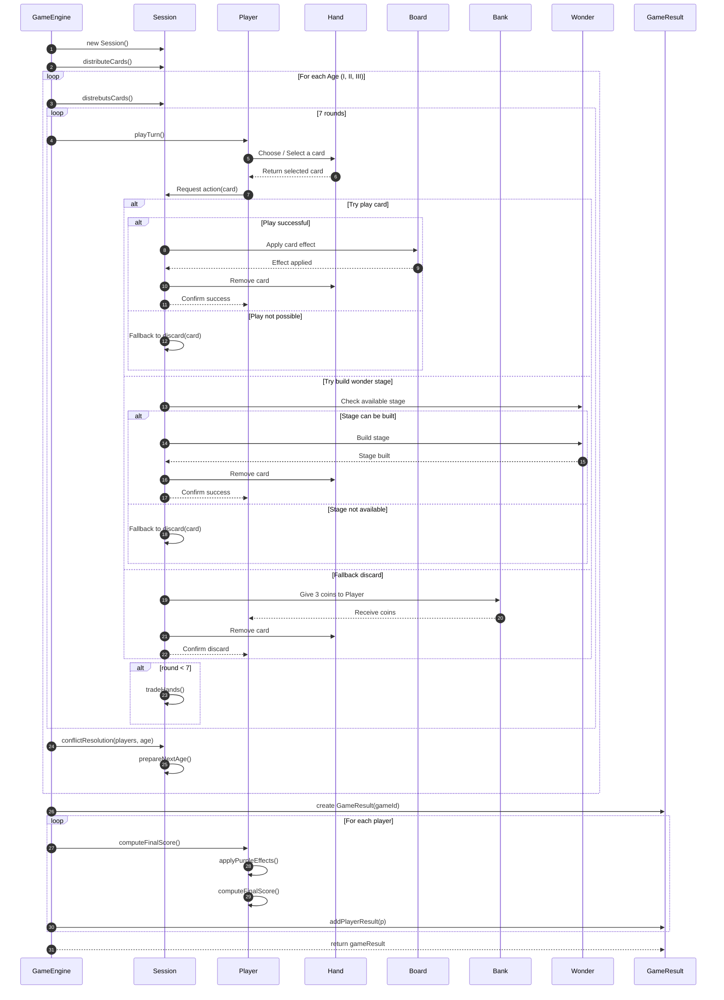

```mermaid
sequenceDiagram
autonumber

participant GameEngine
participant Session
participant Player
participant Hand
participant Board
participant Bank
participant Wonder
participant GameResult

%% ===== GAME INIT =====
GameEngine->>Session: new Session()
GameEngine->>Session: distributeCards()

loop For each Age (I, II, III)
    GameEngine->>Session: distrebutsCards()

    loop 7 rounds
        GameEngine->>Player: playTurn()
        Player->>Hand: Choose / Select a card
        Hand-->>Player: Return selected card
        Player->>Session: Request action(card)

        alt Try play card
            alt Play successful
                Session->>Board: Apply card effect
                Board-->>Session: Effect applied
                Session->>Hand: Remove card
                Session-->>Player: Confirm success
            else Play not possible
                Session->>Session: Fallback to discard(card)
            end

        else Try build wonder stage
            Session->>Wonder: Check available stage
            alt Stage can be built
                Session->>Wonder: Build stage
                Wonder-->>Session: Stage built
                Session->>Hand: Remove card
                Session-->>Player: Confirm success
            else Stage not available
                Session->>Session: Fallback to discard(card)
            end

        else Fallback discard
            Session->>Bank: Give 3 coins to Player
            Bank-->>Player: Receive coins
            Session->>Hand: Remove card
            Session-->>Player: Confirm discard
        end

        %% After each round except last
        alt round < 7
            Session->>Session: tradeHands()
        end
    end

    %% End of Age
    GameEngine->>Session: conflictResolution(players, age)
    Session->>Session: prepareNextAge()
end

%% ===== FINAL SCORING =====
GameEngine->>GameResult: create GameResult(gameId)

loop For each player
    GameEngine->>Player: computeFinalScore()
    Player->>Player: applyPurpleEffects()
    Player->>Player: computeFinalScore()

    GameEngine->>GameResult: addPlayerResult(p)
end

GameEngine-->>GameResult: return gameResult
```