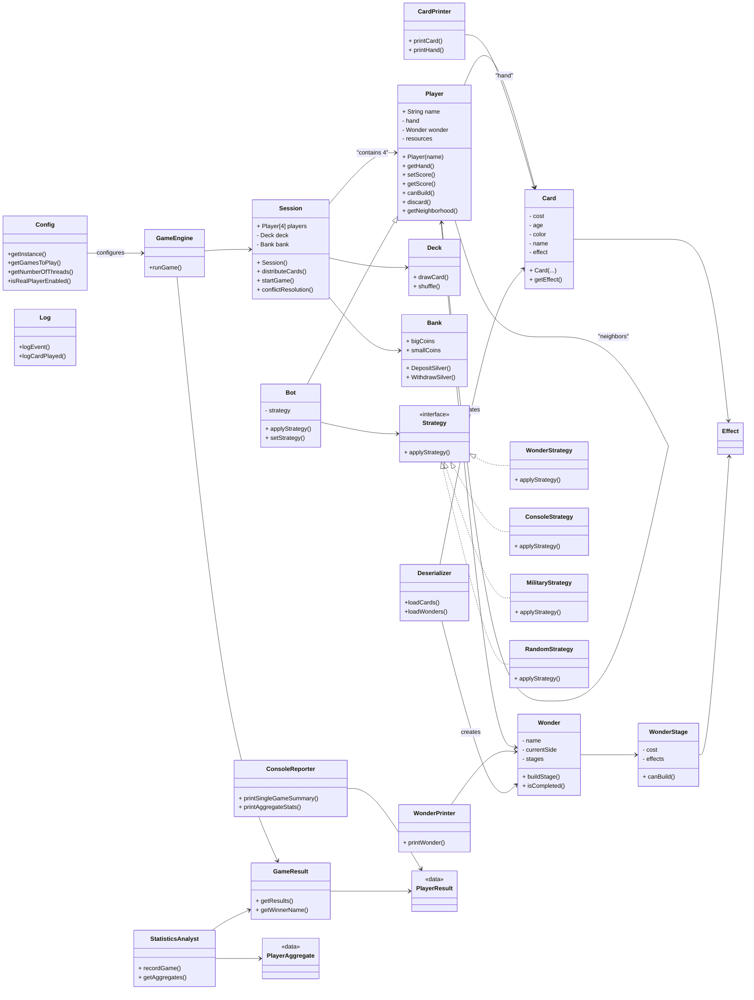

```mermaid
classDiagram
direction LR

%% ============================
%% CONFIG & UTILS
%% ============================

class Config {
    +getInstance()
    +getGamesToPlay()
    +getNumberOfThreads()
    +isRealPlayerEnabled()
}

class Log {
    +logEvent()
    +logCardPlayed()
}

class Deserializer {
    +loadCards()
    +loadWonders()
}

%% ============================
%% CORE & ENGINE
%% ============================

class GameEngine {
    +runGame()
}

class Session {
    + Player[4] players
    - Deck deck
    - Bank bank
    + Session()
    + distributeCards()
    + startGame()
    + conflictResolution()
}

%% ============================
%% ENTITIES
%% ============================

class Player {
    + String name
    - hand
    - Wonder wonder
    - resources
    + Player(name)
    + getHand()
    + setScore()
    + getScore()
    + canBuild()
    + discard()
    + getNeighborhood()
}

class Bot {
    - strategy
    + applyStrategy()
    + setStrategy()
}

class Deck {
    + drawCard()
    + shuffle()
}

class Card {
    - cost
    - age
    - color
    - name
    - effect
    + Card(...)
    + getEffect()
}

class Bank {
    + bigCoins
    + smallCoins
    + DepositSilver()
    + WithdrawSilver()
}

class Wonder {
    - name
    - currentSide
    - stages
    + buildStage()
    + isCompleted()
}

class WonderStage {
    - cost
    - effects
    + canBuild()
}

%% ============================
%% STRATEGIES
%% ============================

class Strategy {
    <<interface>>
    + applyStrategy()
}

class WonderStrategy {
    + applyStrategy()
}

class ConsoleStrategy {
    + applyStrategy()
}

class MilitaryStrategy {
    + applyStrategy()
}

class RandomStrategy {
    + applyStrategy()
}

%% ============================
%% OUTPUT & STATS
%% ============================

class ConsoleReporter {
    + printSingleGameSummary()
    + printAggregateStats()
}

class CardPrinter {
    + printCard()
    + printHand()
}

class WonderPrinter {
    + printWonder()
}

class StatisticsAnalyst {
    + recordGame()
    + getAggregates()
}

class GameResult {
    + getResults()
    + getWinnerName()
}

class PlayerResult {
    <<data>>
}

class PlayerAggregate {
    <<data>>
}

%% ============================
%% RELATIONS
%% ============================

GameEngine --> Session
GameEngine --> GameResult
Session --> Deck
Session --> Player : "contains 4"
Session --> Bank
Player --> Wonder
Player --> Card : "hand"
Player --> Player : "neighbors"

Bot --|> Player
Bot --> Strategy

Strategy <|.. WonderStrategy
Strategy <|.. ConsoleStrategy
Strategy <|.. MilitaryStrategy
Strategy <|.. RandomStrategy

Card --> Effect
Wonder --> WonderStage
WonderStage --> Effect

ConsoleReporter --> PlayerResult
CardPrinter --> Card
WonderPrinter --> Wonder

Deserializer --> Card : creates
Deserializer --> Wonder : creates
Config --> GameEngine : configures

StatisticsAnalyst --> GameResult
StatisticsAnalyst --> PlayerAggregate
GameResult --> PlayerResult

```
