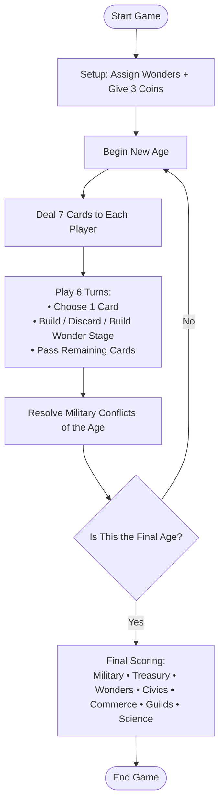

```mermaid
flowchart TD
    Start([Start Game]) --> Init[Setup: Assign Wonders + Give 3 Coins]
    Init --> AgeStart[Begin New Age]

    AgeStart --> Deal[Deal 7 Cards to Each Player]
    Deal --> TurnLoop[Play 6 Turns:<br/>• Choose 1 Card<br/>• Build / Discard / Build Wonder Stage<br/>• Pass Remaining Cards]

    TurnLoop --> Conflict[Resolve Military Conflicts of the Age]

    Conflict --> AgeCheck{Is This the Final Age?}
    AgeCheck -- No --> AgeStart
    AgeCheck -- Yes --> Score[Final Scoring:<br/>Military • Treasury • Wonders • Civics • Commerce • Guilds • Science]

    Score --> End([End Game])


```
