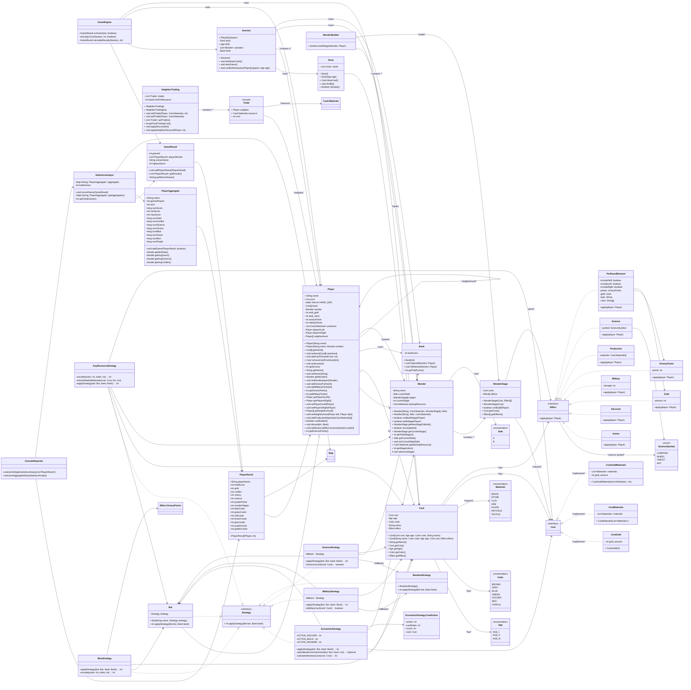

```mermaid
classDiagram
direction LR

%% ============================
%% CORE
%% ============================
class GameEngine {
    +GameResult runGame(int, boolean)
    -void playTurn(Session, int, boolean)
    -GameResult calculateResults(Session, int)
}

%% ============================
%% REPORTING
%% ============================
class ConsoleReporter {
    +void printSingleGameSummary(List~PlayerResult~)
    +void printAggregateStats(StatisticsAnalyst)
}

%% ============================
%% STATS
%% ============================
class GameResult {
    -int gameId
    -List~PlayerResult~ playerResults
    -String winnerName
    -int highestScore
    +void addPlayerResult(PlayerResult)
    +List~PlayerResult~ getResults()
    +String getWinnerName()
}

class PlayerResult {
    +String playerName
    +int totalScore
    +int gold
    +int conflict
    +int victory
    +int science
    +int purplePoints

    +int wonderStages
    +int blueCards
    +int greenCards
    +int redCards
    +int brownCards
    +int greyCards
    +int purpleCards
    +int goldenCards

    +PlayerResult(Player, int)
}

class StatisticsAnalyst {
    -Map~String, PlayerAggregate~ aggregates
    -int totalGames
    +void recordGame(GameResult)
    +Map~String, PlayerAggregate~ getAggregates()
    +int getTotalGames()
}

class PlayerAggregate {
    +String name
    +int gamesPlayed
    +int wins
    +long sumScore
    +int minScore
    +int maxScore
    +long sumGold
    +long sumConflict
    +long sumScience
    +long sumVictory
    +long sumBlue
    +long sumGreen
    +long sumRed
    +long sumPurple
    +void addGame(PlayerResult, boolean)
    +double getWinRate()
    +double getAvgScore()
    +double getAvgScience()
    +double getAvgConflict()
}

%% ============================
%% RELATIONS
%% ============================
GameEngine --> GameResult
GameEngine --> Session
GameEngine --> Player : uses
GameEngine --> Card : uses

ConsoleReporter --> PlayerResult
ConsoleReporter --> StatisticsAnalyst

StatisticsAnalyst --> GameResult
StatisticsAnalyst --> PlayerAggregate

GameResult --> PlayerResult
PlayerResult --> Player
PlayerResult --> Map
StatisticsAnalyst --> Map

PlayerAggregate --> PlayerResult

%% ============================
%% ENUMERATIONS
%% ============================

class Age {
    <<enumeration>>
    AGE_I
    AGE_II
    AGE_III
}

class Color {
    <<enumeration>>
    BROWN
    GRAY
    BLUE
    GREEN
    GOLDEN
    RED
    PURPLE
}

class Materials {
    <<enumeration>>
    WOOD
    STONE
    CLAY
    ORE
    GLASS
    PAPYRUS
    TEXTILE
}

class Side {
    <<enumeration>>
    A
    B
}

%% ============================
%% CLASSES PRINCIPALES
%% ============================

class Session {
    + Player[4] players
    - Deck deck
    + Age AGE
    - List~Wonder~ wonders
    - Bank bank
    + Session()
    + void distributeCards()
    + void startGame()
    + void conflictResolution(Player[] players, Age age)
}

class Player {
    + String name
    + int score
    - static final int HAND_SIZE
    - Card[] hand
    - Wonder wonder
    - int total_gold
    - int total_silver
    - int victoryPoints
    - int militaryPoints
    - List~Card.Materials~ produces
    - Player playerInLeft
    - Player playerInRight
    - Player[] neighborhood
    + Player(String name)
    + Player(String name, Wonder wonder)
    + Card[] getHand()
    + void setHand(Card[] newHand)
    + void addCardToHand(Card, int)
    + Card removeCardFromHand(int)
    + void setScore(int)
    + int getScore()
    + String getName()
    + void setName(String)
    + Wonder getWonder()
    + void setWonderplayer(Wonder)
    + void addVictoryPoints(int)
    + void addMilitaryPoints(int)
    + int getVictoryPoints()
    + int getMilitaryPoints()
    + Player getPlayerInLeft()
    + Player getPlayerInRight()
    + void setPlayerInLeft(Player)
    + void setPlayerInRight(Player)
    + Player[] getNeighborhood()
    + void setNeighborhood(Player left, Player right)
    + void addProductionMaterials(Card.Materials[])
    + boolean canBuild(int)
    + void discard(int, Bank)
    + void addScience(Effect.ScienceSymbol symbol)
    + int getSciencePoints()
}

class Bot {
    - Strategy strategy
    + Bot(String name, Strategy strategy)
    + int applyStrategy(Bot bot, Bank bank)
}

class Deck {
    - List~Card~ cards
    + Deck()
    + Deck(Age age)
    + Card drawCard()
    + void shuffle()
    + boolean isEmpty()
}

class Card {
    - Cost cost
    - Age age
    - Color color
    - String name
    - Effect effect
    + Card(Cost cost, Age age, Color color, String name)
    + Card(String name, Color color, Age age, Cost cost, Effect effect)
    + String getName()
    + Cost getCost()
    + Age getAge()
    + Color getColor()
    + Effect getEffect()
}

class Cost {
    <<interface>>
}

class CostGold {
    - int gold_amount
    + CostGold(int)
}

class CostMaterials {
    - List~Materials~ materials
    + CostMaterials(List~Materials~)
}

class CostGoldMaterials {
    - List~Materials~ materials
    - int gold_amount
    + CostGoldMaterials(List~Materials~, int)
}

class Bank {
    - int totalCoins
    + Bank(int)
    + void DepositSilver(int, Player)
    + void WithdrawSilver(int, Player)
    + int getTotalCoins()
}

class Wonder {
    - String name
    - Side currentSide
    - WonderStage[] stages
    - int currentStage
    - Card.Materials startingResource

    + Wonder(String, Card.Materials, WonderStage[], Side)
    + Wonder(String, Side, Card.Materials)

    + boolean canBuildStage(Player)
    + boolean buildStage(Player)
    + WonderStage getNextStageToBuild()
    + boolean isCompleted()
    + WonderStage getCurrentStage()
    + int getTotalStages()
    + Side getCurrentSide()
    + void setCurrentSide(Side)
    + Card.Materials getStartingResource()
    + int getStageIndex()
    # void advanceStage()
}

class WonderStage {
    - Cost costs
    - Effect[] effects

    + WonderStage(Cost, Effect[])
    + WonderStage(Cost)

    + boolean canBuild(Player)

    + Cost getCosts()
    + Effect[] getEffects()
}

class WonderBuilder {
    + boolean buildStage(Wonder, Player)
}

class Effect {
    <<interface>>
    +apply(player: Player)
}

class Action {
    +apply(player: Player)
}

class Discount {
    +apply(player: Player)
}

class Gold {
    -amount: int
    +apply(player: Player)
}

class Military {
    -strength: int
    +apply(player: Player)
}

class VictoryPoints {
    -points: int
    +apply(player: Player)
}

class Production {
    -materials: Card.Materials[]
    +apply(player: Player)
}

class Science {
    -symbol: ScienceSymbol
    +apply(player: Player)
}

class ScienceSymbol {
    <<enum>>
    COMPASS
    WHEEL
    TABLET
    ANY
}

class PerBoardElement {
    -includeSelf: boolean
    -includeLeft: boolean
    -includeRight: boolean
    -points: VictoryPoints
    -gold: Gold
    -type: String
    -color: String[]
    +apply(player: Player)
}

class NeighborTrading {
    - List~Trade~ trades
    - int baseCostPerResource

    + NeighborTrading()
    + NeighborTrading(int)
    + void addTrade(Player, Card.Materials, int)
    + void addTrade(Player, Card.Materials)
    + List~Trade~ getTrades()
    + int getTotalTradingCost()
    + void applyDiscount(int)
    + void applyNeighborDiscount(Player, int)
}

class Trade {
    <<record>>
    + Player neighbor
    + Card.Materials resource
    + int cost
}

%% ============================
%% STRATEGY SYSTEM
%% ============================

class Strategy {
    <<interface>>
    + int applyStrategy(Bot bot, Bank bank)
}

class RandomStrategy {
    + RandomStrategy()
    + int applyStrategy(Bot bot, Bank bank)
}

class AnyResourceStrategy {
  -encode(action: int, index: int): int
  -extractNeededMaterials(cost: Cost, list: List<Materials>)
  +applyStrategy(bot: Bot, bank: Bank): int
}

class BlueStrategy {
  +applyStrategy(bot: Bot, bank: Bank): int
  -encode(action: int, index: int): int
}

class EconomicStrategy {
  -ACTION_DISCARD : int
  -ACTION_BUILD : int
  -ACTION_WONDER : int

  +applyStrategy(bot: Bot, bank: Bank): int
  -selectBestEconomicAction(bot: Bot, hand: List<Card>): Optional<CardAction>
  -calculateMonetaryCost(cost: Cost): int
}

class EconomicStrategy.CardAction {
  +action: int
  +cardIndex: int
  +score: int
  +cost: Cost
}

class MilitaryStrategy {
  -fallback : Strategy
  +applyStrategy(bot: Bot, bank: Bank): int
  -isMilitaryCard(card: Card): boolean
}

class ScienceStrategy {
  -fallback : Strategy
  +applyStrategy(bot: Bot, bank: Bank): int
  -isScienceCard(card: Card): boolean
}

%% ============================
%% RELATIONS
%% ============================

Session --> Deck : "uses"
Session --> Player : "contains 4"
Session --> Wonder : "uses"
Session --> Bank : "uses"
Deck --> Card : "contains *"
Player "1" --> "1" Wonder
Player "1" --> "7" Card : "contains"
Player --> Bank : "uses"
Player --> Player : "neighborhood"
Card --> Age : "has"
Card --> Color : "has"
Card --> Materials : "requires"
Card --> Cost : "has"
Card --> Effect : "has"
Cost <|.. CostGold : "implements"
Cost <|.. CostMaterials : "implements"
Cost <|.. CostGoldMaterials : "implements"
Effect --> ScienceSymbol : "science symbol"
Wonder --> WonderStage : "contains *"
Wonder --> Side : "has"
WonderStage --> Cost : "requires"
WonderStage --> Effect : "gives"
Bot --|> Player
Bot ..|> Strategy

RandomStrategy ..|> Strategy

AnyResourceStrategy ..|> Strategy
AnyResourceStrategy --> Bot
AnyResourceStrategy --> Card
AnyResourceStrategy --> Wonder
AnyResourceStrategy --> Cost

BlueStrategy ..|> Strategy
BlueStrategy --> Bot
BlueStrategy --> Card
BlueStrategy --> Effect.VictoryPoints

Strategy <|.. EconomicStrategy
EconomicStrategy --> Bot
EconomicStrategy --> Card
EconomicStrategy --> Cost
EconomicStrategy --> Wonder
EconomicStrategy --> EconomicStrategy.CardAction

Strategy <|.. MilitaryStrategy
MilitaryStrategy --> RandomStrategy : «fallback»
MilitaryStrategy --> Bot
MilitaryStrategy --> Card

Strategy <|.. ScienceStrategy
ScienceStrategy --> RandomStrategy : «fallback»
ScienceStrategy --> Bot
ScienceStrategy --> Bank
ScienceStrategy --> Card

Effect <|.. Action
Effect <|.. Discount
Effect <|.. Gold
Effect <|.. Military
Effect <|.. VictoryPoints
Effect <|.. Production
Effect <|.. Science
Effect <|.. PerBoardElement

Science --> ScienceSymbol
PerBoardElement --> VictoryPoints
PerBoardElement --> Gold

Player --> Wonder : "queries"
WonderBuilder --> Wonder : "builds"
WonderBuilder --> WonderStage : "builds"

NeighborTrading --> Trade : "contains *"
Trade --> Player : "neighbor"
Trade --> Card.Materials : "resource"
```
