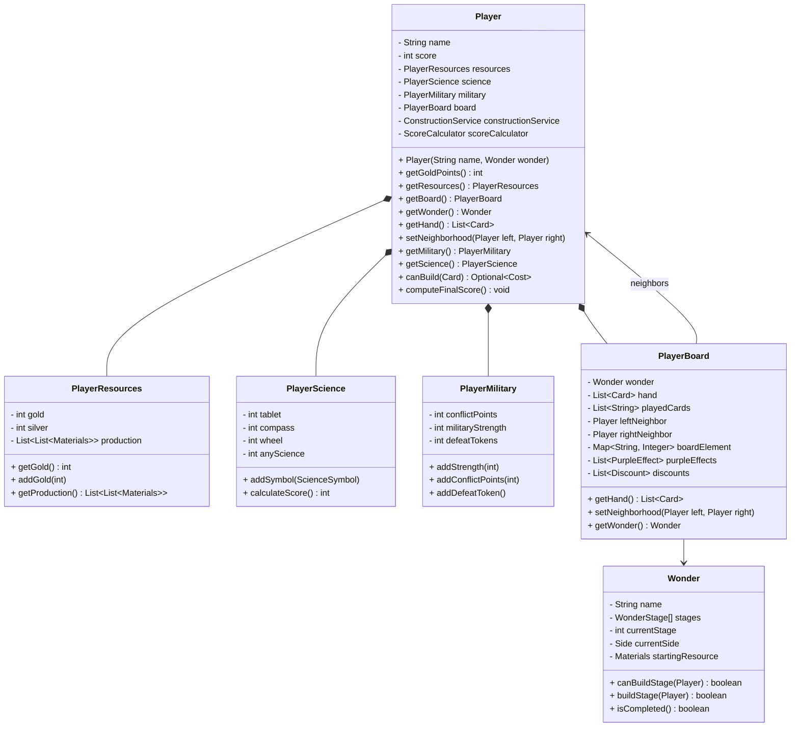

```mermaid
classDiagram
direction TB

class Player {
    - String name
    - int score
    - PlayerResources resources
    - PlayerScience science
    - PlayerMilitary military
    - PlayerBoard board
    - ConstructionService constructionService
    - ScoreCalculator scoreCalculator
    + Player(String name, Wonder wonder)
    + getGoldPoints() int
    + getResources() PlayerResources
    + getBoard() PlayerBoard
    + getWonder() Wonder
    + getHand() List~Card~
    + setNeighborhood(Player left, Player right)
    + getMilitary() PlayerMilitary
    + getScience() PlayerScience
    + canBuild(Card) Optional~Cost~
    + computeFinalScore() void
}

class PlayerResources {
    - int gold
    - int silver
    - List~List~Materials~~ production
    + getGold() int
    + addGold(int)
    + getProduction() List~List~Materials~~
}

class PlayerScience {
    - int tablet
    - int compass
    - int wheel
    - int anyScience
    + addSymbol(ScienceSymbol)
    + calculateScore() int
}

class PlayerMilitary {
    - int conflictPoints
    - int militaryStrength
    - int defeatTokens
    + addStrength(int)
    + addConflictPoints(int)
    + addDefeatToken()
}

class PlayerBoard {
    - Wonder wonder
    - List~Card~ hand
    - List~String~ playedCards
    - Player leftNeighbor
    - Player rightNeighbor
    - Map~String, Integer~ boardElement
    - List~PurpleEffect~ purpleEffects
    - List~Discount~ discounts
    + getHand() List~Card~
    + setNeighborhood(Player left, Player right)
    + getWonder() Wonder
}

class Wonder {
    - String name
    - WonderStage[] stages
    - int currentStage
    - Side currentSide
    - Materials startingResource
    + canBuildStage(Player) boolean
    + buildStage(Player) boolean
    + isCompleted() boolean
}

Player *-- PlayerResources
Player *-- PlayerScience
Player *-- PlayerMilitary
Player *-- PlayerBoard
PlayerBoard --> Wonder
PlayerBoard --> Player : neighbors
```
