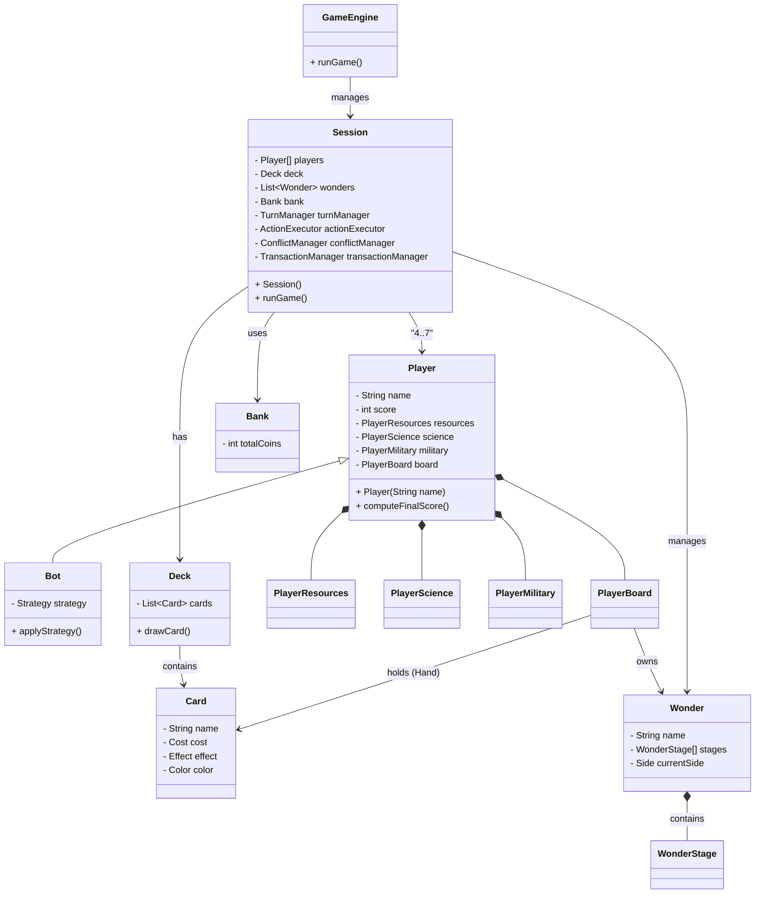

```mermaid
classDiagram
direction TB

class Session {
    - Player[] players
    - Deck deck
    - List~Wonder~ wonders
    - Bank bank
    - TurnManager turnManager
    - ActionExecutor actionExecutor
    - ConflictManager conflictManager
    - TransactionManager transactionManager
    + Session()
    + runGame()
}

class Player {
    - String name
    - int score
    - PlayerResources resources
    - PlayerScience science
    - PlayerMilitary military
    - PlayerBoard board
    + Player(String name)
    + computeFinalScore()
}

class Bot {
    - Strategy strategy
    + applyStrategy()
}

class Deck {
    - List~Card~ cards
    + drawCard()
}

class Card {
    - String name
    - Cost cost
    - Effect effect
    - Color color
}

class Wonder {
    - String name
    - WonderStage[] stages
    - Side currentSide
}

class Bank {
    - int totalCoins
}

class GameEngine {
    + runGame()
}

%% Relations
GameEngine --> Session : manages
Session --> Player : "4..7"
Session --> Deck : has
Session --> Bank : uses
Session --> Wonder : manages

Player <|-- Bot
Player *-- PlayerResources
Player *-- PlayerScience
Player *-- PlayerMilitary
Player *-- PlayerBoard

PlayerBoard --> Wonder : owns
PlayerBoard --> Card : holds (Hand)

Deck --> Card : contains
Wonder *-- WonderStage : contains
```
