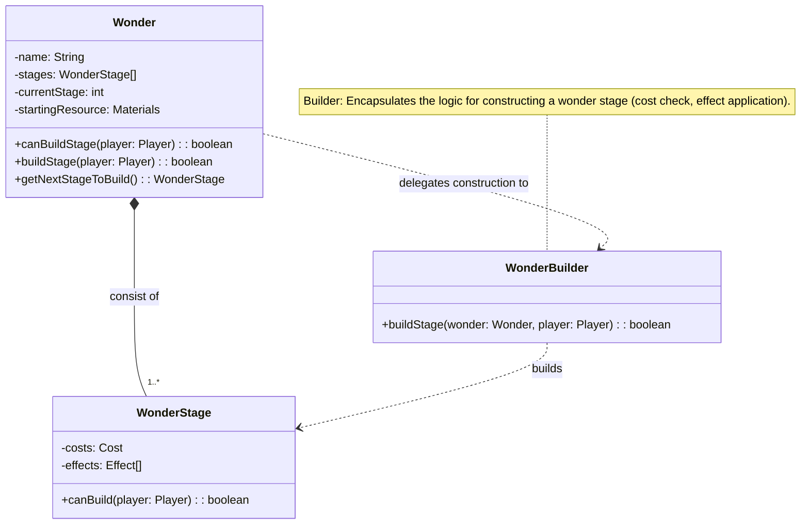

```mermaid
classDiagram
    %% Builder Pattern for Wonder
    
    class Wonder {
        -name: String
        -stages: WonderStage[]
        -currentStage: int
        -startingResource: Materials
        +canBuildStage(player: Player): boolean
        +buildStage(player: Player): boolean
        +getNextStageToBuild(): WonderStage
    }

    class WonderBuilder {
        +buildStage(wonder: Wonder, player: Player): boolean
    }

    class WonderStage {
        -costs: Cost
        -effects: Effect[]
        +canBuild(player: Player): boolean
    }

    %% Relationships
    Wonder ..> WonderBuilder : delegates construction to
    Wonder *-- "1..*" WonderStage : consist of
    WonderBuilder ..> WonderStage : builds
    
    note for WonderBuilder "Builder: Encapsulates the logic for constructing a wonder stage (cost check, effect application)."
```
