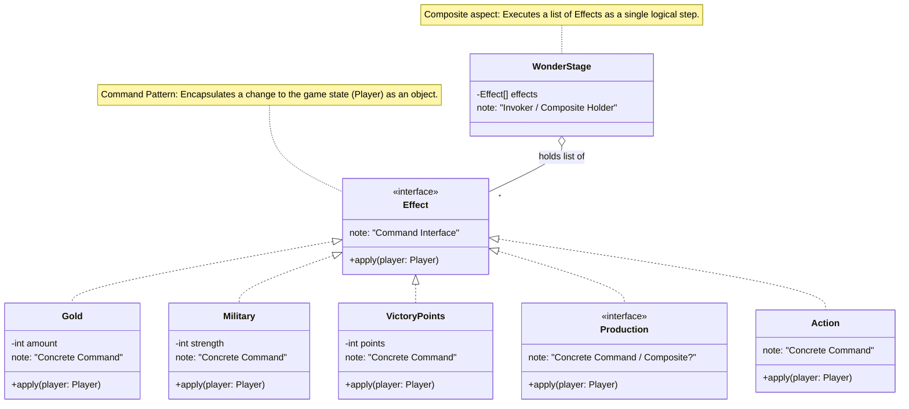

```mermaid
classDiagram
    direction TB
    
    class Effect {
        <<interface>>
        +apply(player: Player)
        note: "Command Interface"
    }

    class Gold {
        -int amount
        +apply(player: Player)
        note: "Concrete Command"
    }

    class Military {
        -int strength
        +apply(player: Player)
        note: "Concrete Command"
    }

    class VictoryPoints {
        -int points
        +apply(player: Player)
        note: "Concrete Command"
    }

    class Production {
        <<interface>>
        +apply(player: Player)
        note: "Concrete Command / Composite?"
    }

    class Action {
        +apply(player: Player)
        note: "Concrete Command"
    }

    class WonderStage {
        -Effect[] effects
        note: "Invoker / Composite Holder"
    }

    WonderStage o-- "*" Effect : holds list of

    Effect <|.. Gold
    Effect <|.. Military
    Effect <|.. VictoryPoints
    Effect <|.. Production
    Effect <|.. Action

    note for Effect "Command Pattern: Encapsulates a change to the game state (Player) as an object."
    note for WonderStage "Composite aspect: Executes a list of Effects as a single logical step."
```
