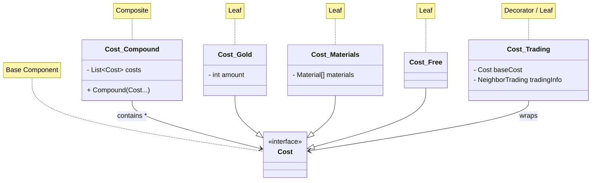

```mermaid
classDiagram

    %% ==== Base Interface ====
    class Cost {
        <<interface>>
    }
    note for Cost "Base Component"

    %% ==== Composite ====
    class Cost_Compound {
        - List~Cost~ costs
        + Compound(Cost...)
    }
    note for Cost_Compound "Composite"
    Cost_Compound --> Cost : contains *

    %% ==== Leaf: Gold ====
    class Cost_Gold {
        - int amount
    }
    note for Cost_Gold "Leaf"
    Cost_Gold --|> Cost

    %% ==== Leaf: Materials ====
    class Cost_Materials {
        - Material[] materials
    }
    note for Cost_Materials "Leaf"
    Cost_Materials --|> Cost

    %% ==== Leaf: Free ====
    class Cost_Free {
    }
    note for Cost_Free "Leaf"
    Cost_Free --|> Cost

    %% ==== Decorator / Leaf: Trading ====
    class Cost_Trading {
        - Cost baseCost
        - NeighborTrading tradingInfo
    }
    note for Cost_Trading "Decorator / Leaf"
    Cost_Trading --> Cost : wraps
```