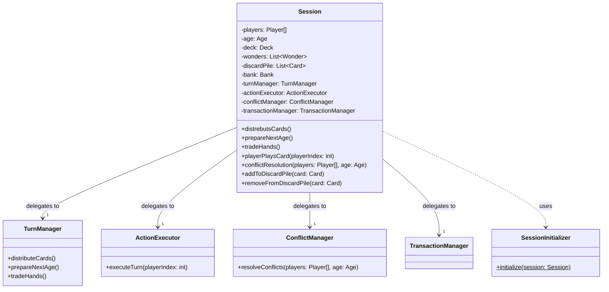

```mermaid
classDiagram
    %% Facade
    class Session {
        -players: Player[]
        -age: Age
        -deck: Deck
        -wonders: List~Wonder~
        -discardPile: List~Card~
        -bank: Bank
        -turnManager: TurnManager
        -actionExecutor: ActionExecutor
        -conflictManager: ConflictManager
        -transactionManager: TransactionManager
        +distrebutsCards()
        +prepareNextAge()
        +tradeHands()
        +playerPlaysCard(playerIndex: int)
        +conflictResolution(players: Player[], age: Age)
        +addToDiscardPile(card: Card)
        +removeFromDiscardPile(card: Card)
    }

    %% Subsystem Components
    class TurnManager {
        +distributeCards()
        +prepareNextAge()
        +tradeHands()
    }

    class ActionExecutor {
        +executeTurn(playerIndex: int)
    }

    class ConflictManager {
        +resolveConflicts(players: Player[], age: Age)
    }

    class TransactionManager {
        
    }

    class SessionInitializer {
        +initialize(session: Session)$
    }

    %% Relationships
    Session --> "1" TurnManager : delegates to
    Session --> "1" ActionExecutor : delegates to
    Session --> "1" ConflictManager : delegates to
    Session --> "1" TransactionManager : delegates to
    Session ..> SessionInitializer : uses
```
