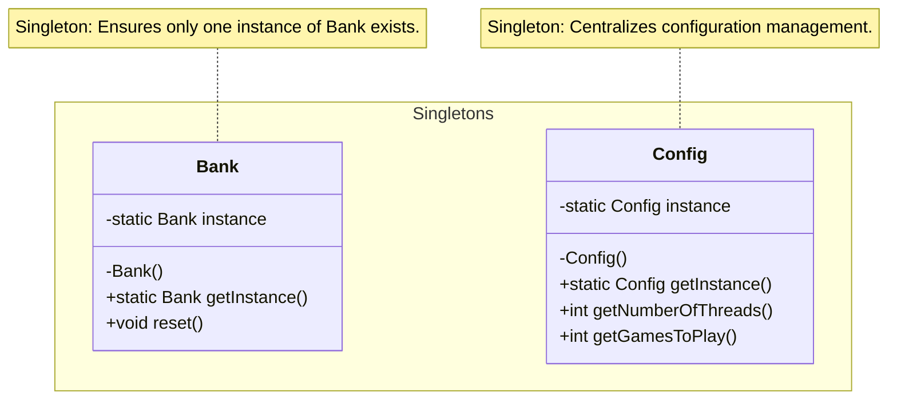

```mermaid
classDiagram
    direction TB
    
    namespace Singletons {
        class Bank {
            -static Bank instance
            -Bank()
            +static Bank getInstance()
            +void reset()
        }
    
        class Config {
            -static Config instance
            -Config()
            +static Config getInstance()
            +int getNumberOfThreads()
            +int getGamesToPlay()
        }
    }
    
    note for Bank "Singleton: Ensures only one instance of Bank exists."
    note for Config "Singleton: Centralizes configuration management."
```
