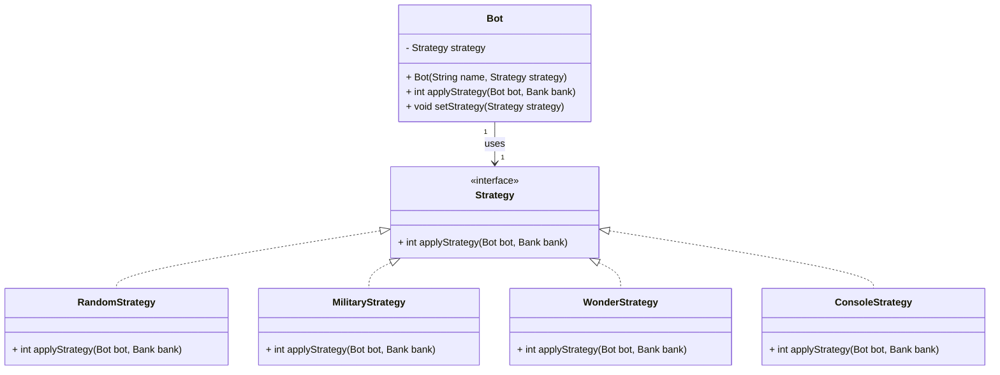

```mermaid
classDiagram
direction TB
%% ============================
%% STRATEGY PATTERN
%% ============================

class Bot {
    - Strategy strategy
    + Bot(String name, Strategy strategy)
    + int applyStrategy(Bot bot, Bank bank)
    + void setStrategy(Strategy strategy)
}

class Strategy {
    <<interface>>
    + int applyStrategy(Bot bot, Bank bank)
}

class RandomStrategy {
    + int applyStrategy(Bot bot, Bank bank)
}

class MilitaryStrategy {
    + int applyStrategy(Bot bot, Bank bank)
}

class WonderStrategy {
    + int applyStrategy(Bot bot, Bank bank)
}

class ConsoleStrategy {
    + int applyStrategy(Bot bot, Bank bank)
}

Bot "1" --> "1" Strategy : uses
Strategy <|.. RandomStrategy
Strategy <|.. MilitaryStrategy
Strategy <|.. WonderStrategy
Strategy <|.. ConsoleStrategy
```
